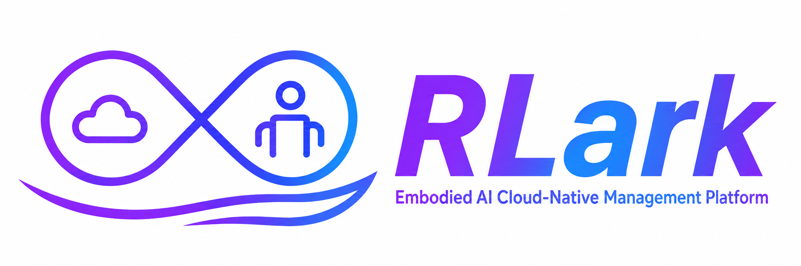
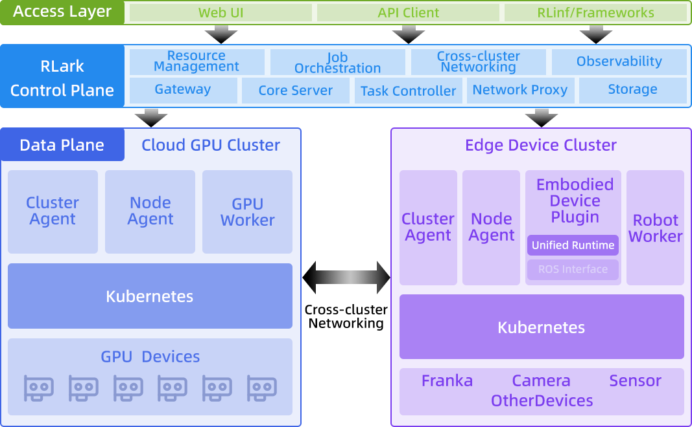

<div align="center">
  
</div>

<div align="center">
  <a href="README.md"></a>
  <a href="README.zh-CN.md"></a>
  
  
  
</div>

<h1 align="center">
  <sub>RLark — Cross-Cluster Embodied Intelligence Cloud-Native Platform</sub>
</h1>

Manage cross-cluster embodied intelligence workloads through a unified cloud-native platform spanning cloud GPU training, cross-cluster collaboration, and edge device deployment across heterogeneous resources such as GPU clusters, robot arms, sensors, and cameras.

## What's NEW!

- [2026/08] RLark is now open-source.

## Key Capabilities

- **Embodied AI Workload Orchestration**: From cloud GPU training (RL/LLM) to edge deployment (robot arm, sensor, camera), unified declarative Job/Workflow/Task abstraction across the full pipeline
- **Multi-Runtime Data Plane**: Kubernetes provides unified management for cloud GPU clusters and edge devices across the complete training-to-deployment lifecycle; Docker and Raw runtime support will extend coverage to lightweight edge scenarios where Kubernetes is not suitable
- **Cross-Cluster Resource Abstraction**: Unify multi-site GPU clusters and edge devices via Domain (virtual network domain) and Node (compute node) CRDs, with the control plane running on kcp
- **Declarative Training Jobs**: Multi-layer abstraction (Job/Workflow/Task) with DAG-based training pipelines and declarative Ray cluster definition
- **Cross-Cluster Pod Networking**: Virtual network based on TUN devices + gVisor netstack + SSH tunnels, enabling Pod-to-Pod communication without NAT traversal — cloud GPUs and edge robots communicate directly
- **Certificate System**: Dual-layer X.509 + SSH certificates for Agent access, Domain-scoped cross-cluster forwarding authentication, and user SSH authentication
- **Observability**: Prometheus metrics, real-time Pod log streaming, and web management UI

## Architecture Overview



## Quick Start

See the [Quick Start Guide](apps/rlark/docs/quickstart.md) for a step-by-step guide to set up a local development environment and run your first training job.

```bash
# 1. Build
git clone https://github.com/RLinf/RLark
cd RLark && make build

# 2. Start control plane (Docker Compose)
docker compose -f apps/rlark/docs/examples/docker-compose.yml up -d

# 3. Start data plane (kind cluster)
kind create cluster --name rlark-data

# Then follow the quickstart guide to start components and create a job
```

## Documentation

| Document | Description |
|----------|-------------|
| [Architecture](apps/rlark/docs/architecture.md) | RLark core: technical architecture, component interactions, data flows |
| [Core Concepts](apps/rlark/docs/concepts.md) | Domain, Job, Task, Workflow, and other concepts |
| [Quick Start](apps/rlark/docs/quickstart.md) | Local development environment setup and first training job |
| [Deployment Guide](apps/rlark/docs/deployment.md) | Production deployment and configuration |
| [API Reference](apps/rlark/docs/api/reference.md) | Complete REST API reference |
| [API Examples](apps/rlark/docs/api/examples.md) | End-to-end API usage examples |
| [Embodied Runtime](apps/embodied-runtime/README.md) | Robot (ROS) and camera hardware management on edge nodes |
| [Web UI](apps/rlark-ui/README.md) | Frontend management console |
| [Python SDK](sdks/embodied-runtime-python/README.md) | Python client for robot/camera gRPC services |
| [Go SDK](sdks/embodied-runtime-go/README.md) | Go client for embodied-runtime gRPC stubs |
| [Proto Definitions](proto/embodied-runtime/README.md) | gRPC service definitions for embodied-runtime |

> [中文文档](apps/rlark/docs/zh/README.md)

## Tech Stack

- **Language**: Go (control plane/agent) + TypeScript (frontend)
- **Orchestration**: Kubernetes (kcp + kind)
- **Networking**: TUN device + gVisor netstack + SSH tunnel
- **Certificates**: X.509 mTLS + SSH certificates
- **Database**: PostgreSQL (Bun ORM)
- **Monitoring**: Prometheus
- **Frontend**: React + Vite + TypeScript

## Contributing

We welcome contributions! Please see [CONTRIBUTING.md](CONTRIBUTING.md) for guidelines, and [CODE_OF_CONDUCT.md](CODE_OF_CONDUCT.md) for our community standards.

## License

RLark is licensed under the [Apache License 2.0](LICENSE).
