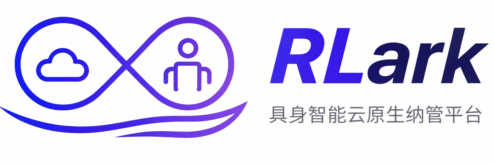
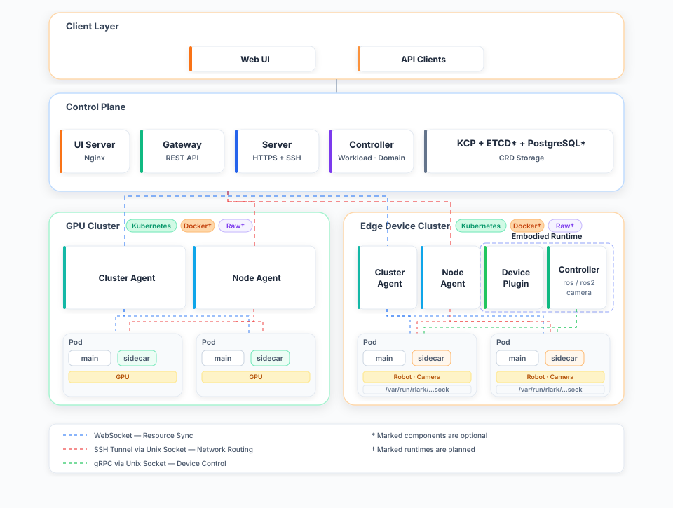

<div align="center">
  
</div>

<div align="center">
  <a href="README.md"></a>
  <a href="README.zh-CN.md"></a>
  
  
  
</div>

<h1 align="center">
  <sub>RLark 具身智能云原生纳管平台</sub>
</h1>

以 Kubernetes 原生方式管理跨集群具身智能工作负载，从云端 GPU 训练到端侧设备部署。通过统一的任务调度、跨集群 Pod 网络互通和多运行时支持（k8s 生产就绪，Docker/Raw 实验性），实现 GPU 集群、机械臂、传感器等异构设备间的无缝协同。

## 最新动态

- [2026/08] RLark 现已开源。

## 核心能力

- **具身智能工作负载编排**：从云端 GPU 训练（RL/LLM）到端侧部署（机械臂、传感器、摄像头），统一的声明式 Job/Workflow/Task 抽象覆盖全链路
- **多运行时数据面**：原生支持 Kubernetes 运行时（生产就绪），Docker 和 Raw 运行时处于实验性/规划阶段 — GPU 集群运行 k8s 承载大规模训练，端侧设备运行 k8s 或 Docker 实现轻量级具身部署
- **跨集群资源抽象**：通过 Domain（安全域）和 Node（计算节点）CRD 统一管理多地 GPU 集群和端侧设备，控制面运行在 kcp 之上
- **声明式训练任务**：Job/Workflow/Task 多层抽象，支持 DAG 编排的训练流水线，声明式定义 Ray 集群
- **跨集群 Pod 网络**：基于 TUN 设备 + gVisor 协议栈 + SSH 隧道的虚拟网络，Pod 跨集群通信无需 NAT 穿透 — 云端 GPU 与端侧机器人直接通信
- **证书体系**：X.509 + SSH 双层证书，支持 Agent 接入、Domain 隔离、用户 SSH 登录鉴权
- **可观测性**：Prometheus 指标暴露、Pod 日志实时查询、Web 管理界面

## 架构概览



## 快速开始

```bash
# 1. 安装 CLI
git clone https://github.com/RLinf/RLark
cd RLark && make build

# 2. 部署控制面（Kubernetes 模式）
./bin/rlarkadm install -f apps/rlark/docs/examples/deploy-control-plane.yaml

# 3. 部署数据面 Agent
./bin/rlarkadm install -f apps/rlark/docs/examples/deploy-data-plane.yaml

# 4. 创建训练任务
curl -X POST http://localhost:8080/api/v1/rlinf.io/v1alpha1/jobs \
  -H "Content-Type: application/json" \
  -d '{"apiVersion":"rlinf.io/v1alpha1","kind":"Job","metadata":{"name":"hello-world"},"spec":{"domain":"my-first-domain","tasks":[{"name":"trainer","head":true,"role":"Actor","agentType":"Kubernetes","kubernetes":{"workload":{"kind":"Deployment","replicas":1,"template":{"spec":{"containers":[{"name":"trainer","image":"busybox:latest","command":["sh","-c","echo Hello from rlark! && sleep 3600"]}]}}}}}}]}}'
```

## 文档索引

| 文档 | 说明 |
|------|------|
| [架构设计](apps/rlark/docs/cn/architecture.md) | RLark 核心：完整技术架构、组件交互、数据流 |
| [核心概念](apps/rlark/docs/cn/concepts.md) | Domain、Job、Task、Workflow 等概念解释 |
| [快速开始](apps/rlark/docs/cn/quickstart.md) | 本地开发环境搭建与第一个训练任务 |
| [部署指南](apps/rlark/docs/cn/deployment.md) | 生产环境部署、配置说明 |
| [API 参考](apps/rlark/docs/api/reference.md) | 完整的 REST API 参考 |
| [API 示例](apps/rlark/docs/api/examples.md) | 端到端 API 调用示例 |
| [Embodied Runtime](apps/embodied-runtime/README.md) | 端侧机器人/摄像头运行时管理 |
| [Web UI](apps/rlark-ui/README.md) | 前端管理界面说明 |
| [Python SDK](sdks/embodied-runtime-python/README.md) | 机器人/摄像头 gRPC 客户端 |
| [Go SDK](sdks/embodied-runtime-go/README.md) | Go 语言 gRPC 客户端 |
| [Proto 定义](proto/embodied-runtime/README.md) | gRPC 服务接口定义 |

> [English Documentation](apps/rlark/docs/README.md)

## 技术栈

- **语言**：Go (控制面/Agent) + TypeScript (前端)
- **编排**：Kubernetes (kcp + kind)
- **网络**：TUN 设备 + gVisor netstack + SSH 隧道
- **证书**：X.509 mTLS + SSH 证书
- **数据库**：PostgreSQL (Bun ORM)
- **监控**：Prometheus
- **前端**：React + Vite + TypeScript

## 参与贡献

欢迎贡献！请参阅 [CONTRIBUTING.md](CONTRIBUTING.md) 了解贡献指南，以及 [CODE_OF_CONDUCT.md](CODE_OF_CONDUCT.md) 了解社区行为准则。

## 开源协议

RLark 基于 [Apache License 2.0](LICENSE) 开源。
