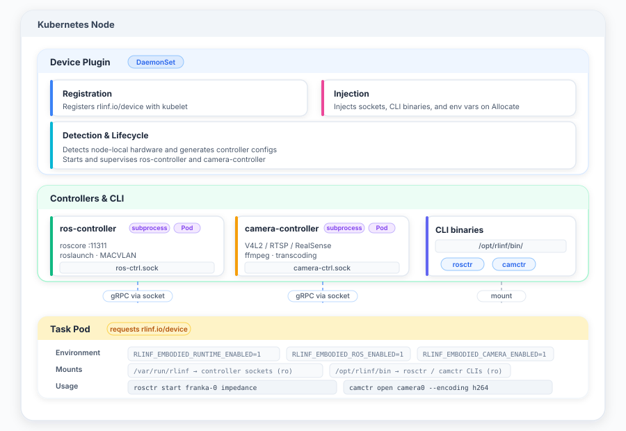

# embodied-runtime

[English](./README.md) | 简体中文

一个面向边缘节点的 Kubernetes 原生运行时，用于管理机器人（ROS）与摄像头硬件。它通过 [Device Plugin API][device-plugin] 将机器人和摄像头暴露为**可调度的 Kubernetes 资源**，业务 Pod 在申请该资源后，即可通过定义良好的 gRPC 接口与 CLI 访问节点本地硬件。

embodied-runtime 面向机器人学习 / 遥操作集群：每个节点挂载一台或多台机器人（例如 Franka 机械臂）与摄像头。调度器把 Pod 调度到声明了 `rlinf.io/device` 资源的节点上，Pod 再通过 Unix socket 与节点本地控制器通信来驱动硬件。

[device-plugin]: https://kubernetes.io/zh-cn/docs/concepts/extend-kubernetes/compute-storage-net/device-plugins/

---

## 核心特性

- **Kubernetes Device Plugin** —— 申报 `rlinf.io/device`（或 `rlinf.io/device-<model>`）资源，在分配时把 socket 目录与 CLI 目录挂载到 Pod。
- **ROS 1 Controller** —— 每个机器人独占一个 `roscore`（端口从 11311 起递增），基于 `roslaunch` 管理节点生命周期，支持控制模式切换（impedance / joint / 自定义）、MACVLAN 组网，以及可选的机器人 Web 服务反向代理。
- **ROS 2 Controller** —— 每个机器人独占一个 `ROS_DOMAIN_ID`（无 master），基于 `ros2 launch` 管理生命周期，使用 `ros2 pkg` / `ros2 launch --show-args` 做包内省，MACVLAN 组网与反向代理与 ROS 1 共享。基于 Humble 发行版。
- **Camera Controller** —— 通过 `ffmpeg` 采集 V4L2 / RTSP / RealSense 摄像头，支持 JPEG / PNG / BMP / TIFF 无损静图与 H.264 / H.265 编码及实时转码，提供基于 gRPC 的视频帧流。
- **宿主设备透传** —— 在 Allocate 时把宿主 `/dev/*` 节点（串口、声卡、裸字符设备等）直接挂载进 Pod，无需控制器，仅需在 `host_devices` 下列出即可。
- **宿主 macvlan 配置** —— 通过 gRPC 服务与 `devinit` init 容器 CLI 按需把节点配置的 macvlan 接口注入到请求 Pod 的网络命名空间（不是设备挂载）；使用 `hostNetwork` 的 Pod 会被跳过。
- **灵活的控制器部署** —— 每个控制器可独立配置为**本地子进程**或 **Kubernetes Pod**。
- **CLI** —— `rosctr`（ROS 1 与 ROS 2 共用）与 `camctr`，供运维或在 Pod 内调用控制器，支持 `text` / `json` / `yaml` 输出。
- **静态链接的 Go 二进制** —— 全部七个二进制以单一多架构 `embodied-runtime` 镜像交付，部署时由 initContainer 注入到对应运行时镜像：`camera-controller` 运行于 `camera-base` 镜像（Alpine + `ffmpeg`），`ros-controller` 运行于 ROS 1 workspace 镜像，`ros2-controller` 运行于 ROS 2 Humble workspace 镜像。

---

## 架构



device-plugin 是入口。启动时它依次：

1. 向 kubelet 注册并申报 `rlinf.io/device[-<model>]` 资源。
2. 探测硬件，生成 ros-controller / ros2-controller / camera-controller 的 YAML 配置。
3. 启动控制器 —— 每个可独立选择本地子进程或 Pod 模式（`manager_mode: local | pod | disabled`）。
4. 收到 `Allocate` 请求时，把 socket 目录（`/var/run/rlark`）与 CLI 目录（`/opt/rlinf/bin`）注入业务 Pod，并通过 `RLINF_EMBODIED_*` 环境变量告知哪些运行时可用，同时暴露其 socket 路径（`RLINF_EMBODIED_{ROS,ROS2,CAMERA}_SOCKET_PATH`），使 CLI 无需硬编码即可连接。配置 `host_devices` 下列出的宿主 `/dev/*` 节点会作为 `DeviceSpec` 直接透传挂载（不经过控制器）。当配置了 `host_macvlans` 时，插件还会在 `/var/run/rlark/devinit.sock` 上启动一个按需设备 gRPC 服务；Pod 的 init 容器执行 `devinit setup` 即可把节点配置的 macvlan 注入到自身网络命名空间。

业务 Pod 随后用挂载进来的 CLI（或直接走 gRPC）驱动硬件。

---

## 组件

| 二进制              | 包                                   | 职责                                                |
|---------------------|--------------------------------------|-----------------------------------------------------|
| `device-plugin`     | `cmd/device-plugin`                  | kubelet 设备插件，托管所有控制器。                  |
| `ros-controller`    | `cmd/ros-controller`                 | ROS 1 机器人生命周期：roscore、roslaunch、模式切换、Web 代理。|
| `ros2-controller`   | `cmd/ros2-controller`                | ROS 2 机器人生命周期：ros2 launch、DOMAIN_ID、模式切换、代理。|
| `camera-controller` | `cmd/camera-controller`              | 摄像头生命周期：打开/关闭、采集、流化、转码。        |
| `rosctr`            | `cmd/rosctr`                         | RobotController gRPC CLI（ROS 1 **与** ROS 2 共用）。|
| `camctr`            | `cmd/camctr`                         | camera-controller 的 gRPC CLI。                      |
| `devinit`           | `cmd/devinit`                        | init 容器 CLI：向 device plugin 请求按需设备配置（注入 macvlan）。|

### gRPC 服务

定义在 [`proto/embodied-runtime/`](../../proto/embodied-runtime)：

- `ros.controller.v1.RobotController` —— [`proto/embodied-runtime/roscontroller/v1/robot.proto`](../../proto/embodied-runtime/roscontroller/v1/robot.proto)
- `camera.controller.v1.CameraController` —— [`proto/embodied-runtime/cameracontroller/v1/camera.proto`](../../proto/embodied-runtime/cameracontroller/v1/camera.proto)
- `device.v1.DeviceService` —— [`proto/embodied-runtime/device/v1/device.proto`](../../proto/embodied-runtime/device/v1/device.proto)

两个服务均通过 **Unix socket** 提供（`/var/run/rlark/*.sock`）。`RobotController` 服务由两个独立控制器实现，注册在不同 socket 上：`ros-controller` 在 `ros-ctrl.sock`（ROS 1），`ros2-controller` 在 `ros2-ctrl.sock`（ROS 2）。两者遵循同一套 RPC 契约和 proto，因此单个 `rosctr` CLI 和 SDK 客户端只需指向对应 socket 即可操作任一控制器。`DeviceService` 由 device plugin 自身在 `devinit.sock` 上提供，用于按需注入 macvlan（见[宿主 macvlan 配置](#宿主-macvlan-配置)）。

完整 API 参考（RPC、消息、枚举）：[`proto-api.zh-CN.md`](./proto-api.zh-CN.md)。

---

## 构建

需要 Go 1.26+。

```bash
make build        # 仅编译二进制 → bin/
make test         # 单元测试
make vet          # go vet
```

二进制以 `CGO_ENABLED=0` 静态编译。

### Docker 镜像

```bash
# embodied-runtime 镜像 —— 包含全部 6 个二进制（静态，多架构）
make docker REGISTRY=ghcr.io/your-org IMAGE_TAG=v0.1.0

# camera-base 镜像 —— Alpine + ffmpeg 运行时依赖（不含二进制；
# 部署时由 initContainer 注入）
make docker-camera REGISTRY=ghcr.io/your-org IMAGE_TAG=v0.1.0

# ros-base 镜像 —— ROS Noetic + 控制包（用于 ROS 1 控制器）
make docker-ros REGISTRY=ghcr.io/your-org IMAGE_TAG=v0.1.0

# ros2-base 镜像 —— ROS 2 Humble + 控制包（用于 ROS 2 控制器）
make docker-ros2 REGISTRY=ghcr.io/your-org IMAGE_TAG=v0.1.0
```

可覆盖变量：`REGISTRY`、`IMAGE_TAG` / `VERSION`、`BUILDX_PLATFORMS`、`GO_BASE_IMAGE`、`RUNTIME_BASE_IMAGE`、`APK_MIRROR`。

---

## 配置

### device-plugin

通过 `--config <path>` 加载；所有字段均可省略（见 [`examples/device-plugin-config.yaml`](./examples/device-plugin-config.yaml)）。

```yaml
# model: franka          # → 资源 rlinf.io/device-franka，
                          #   socket rlinf-device-franka.sock
device_count: 1
skip_register: false

# 直接把宿主 /dev/* 设备节点挂载进 Pod（在 Allocate 时注入）。不启动
# 任何控制器，仅按以下列表做透传。省略本段（或留空）即关闭透传。
host_devices:
  - host_path: /dev/video0
    # container_path: /dev/video0  # 默认与 host_path 相同
    # permissions: rwm             # r|w|m 任意组合；默认 rwm
  - host_path: /dev/ttyUSB0
    permissions: rw

# 按需 macvlan 配置（不是设备挂载 —— macvlan 是创建在 Pod 网络命名
# 空间内的网络接口）。插件在 /var/run/rlark/devinit.sock 上启动一个
# 设备 gRPC 服务；Pod 的 init 容器执行 `devinit setup` 即可把这些
# macvlan 注入到自身网络命名空间。使用 hostNetwork 的 Pod 会被跳过。
# 每个条目是一个 pkg/netmac MACVLANConfig：host_nic 为空时按 IP 子网
# 自动探测；ip 可填网络地址（如 172.16.0.0/24），会自动挑选未用主机 IP。
host_macvlans:
  - host_nic: eno1
    name: macvlan0
    ip: 172.16.0.0/24      # 网络地址 → 自动挑选未用主机 IP
    # gateway: 172.16.0.1  # 可选，机器人子网的默认网关

camera:
  manager_mode: local     # disabled | local | pod
  ctrl_config_path: /etc/rlinf/camera-controller.yaml
  ctrl_bin: /usr/local/bin/camera-controller
  ctr_cli: /opt/rlinf/bin/camctr
  auto_detect_v4l2: true  # 自动探测 /dev/video* 摄像头
  cameras: []

ros:
  manager_mode: local     # disabled | local | pod
  ctrl_config_path: /etc/rlinf/ros-controller.yaml
  ctrl_bin: /usr/local/bin/ros-controller
  ctr_cli: /opt/rlinf/bin/rosctr
  macvlans:
    - host_nic: eno1
      name: macvlan0
      ip: 172.16.0.101/24
  types:
    - type: franka
      modes:
        impedance:
          package: serl_franka_controllers
          launch_file: impedance.launch
          passthrough_robot_args: true
        joint:
          package: serl_franka_controllers
          launch_file: joint.launch
          passthrough_robot_args: true
  robots:
    - id: franka-robot-1
      type: franka
      params:
        robot_ip: 172.16.0.2
      web_service: https://172.16.0.2/
  allowed_launch_packages:
    - serl_franka_controllers

ros2:
  manager_mode: local     # disabled | local | pod
  ctrl_config_path: /etc/rlinf/ros2-controller.yaml
  ctrl_bin: /usr/local/bin/ros2-controller
  ctr_cli: /opt/rlinf/bin/rosctr    # 与 ROS 1 共用
  macvlans:
    - host_nic: eno1
      name: macvlan0
      ip: 172.16.0.101/24
  types:
    - type: franka
      modes:
        impedance:
          package: moveit_servo
          launch_file: servo.launch.py
          passthrough_robot_args: true
  robots:
    - id: franka-robot-1
      type: franka
      params:
        robot_ip: 172.16.0.2
      domain_id: 5            # 显式 ROS_DOMAIN_ID 覆盖（为 0 时自动分配）
  allowed_launch_packages:
    - moveit_servo
```

**Manager 模式**（`camera.manager_mode` / `ros.manager_mode` / `ros2.manager_mode`）：

| 模式       | 行为                                                     |
|------------|----------------------------------------------------------|
| `disabled` | 不启动控制器、不生成配置（默认）。                       |
| `local`    | 控制器作为 device-plugin 的子进程运行。                  |
| `pod`      | 控制器在独立 Pod 中运行，由 device-plugin 创建并托管。   |

在 `pod` 模式下，device-plugin 会自动发现自身 Pod 的属性（owner refs、tolerations、镜像、节点名）并复用填充控制器 Pod 的空字段，使控制器 Pod 随 device-plugin Pod 一起被垃圾回收，并被调度到同一个带污点的节点上。

### ROS controller 组网

每个机器人拥有独立的 `roscore`（端口从 `11311` 起递增），多机器人可在同一容器内共存而不冲突 topic / 节点名。`ROS_MASTER_URI` 与 `ROS_IP` 会被注入每个 `roslaunch` 进程。启动时按配置创建 MACVLAN 接口以接入机器人网络；`roslaunch` 直接在容器内运行（不使用 `nsenter`）。

### ROS 2 controller 组网

与 ROS 1 不同，ROS 2 没有中央 master。每个机器人拥有独立的 `ROS_DOMAIN_ID`（自动从 0 递增分配，或通过 robot 配置中的 `domain_id` 显式指定），实现 DDS 级隔离，使同一容器内的多机器人互不发现对方的 topic / service。`ROS_DOMAIN_ID`（及可选的 `RMW_IMPLEMENTATION`、`CYCLONEDDS_URI`）会注入每个 `ros2 launch` 进程。MACVLAN 接口与 ROS 1 控制器共享以接入机器人物理网。基础镜像默认使用 Cyclone DDS（`rmw_cyclonedds_cpp`），更适合多机器人与跨子网发现场景。

> **组播要求。** ROS 2 DDS 默认使用 IP 组播进行节点发现。集群的网络层（CNI 插件、节点 / 底层交换机）**必须支持组播路由**，跨 Pod / 跨节点的 ROS 2 节点才能互相发现。如果集群不支持组播（许多云厂商 CNI 默认会屏蔽），需改为单播发现 —— 在每个 robot 的 mode 级 `env` 中设置 `CYCLONEDDS_URI`（或 Fast DDS 等价配置）为 peer-list XML profile，或部署 DDS Discovery Server。MACVLAN 的 L2 接口可直接接入机器人物理子网（该子网内组播通常可用），但 Pod 间 / 节点间的发现仍取决于集群网络。

### Camera controller

摄像头可静态配置，或从 `/sys/class/video4linux` 自动探测。采集通过拉起 `ffmpeg` 子进程完成；驱动按设备原生格式采集，并按需转码为目标输出 —— 帧模式静图编码（`jpeg` / `png` / `bmp` / `tiff`，每条消息一帧完整可解码图像）或码流编码（`h264` / `h265`，Annex B 基础码流分片）。

### 宿主设备透传

除 camera 与 ROS 控制器外，device plugin 还可在 Allocate 时把宿主 `/dev/*` 节点（如 `/dev/video0`、`/dev/ttyUSB0`、`/dev/snd/controlC0`）直接挂载进 Pod。该路径不经过任何控制器 —— 配置中 `host_devices` 下列出的条目会作为 `DeviceSpec` 透传挂载，因此适合无需生命周期管理的设备（裸字符设备、串口、声卡等）。

```yaml
host_devices:
  - host_path: /dev/video0       # 必填
    container_path: /dev/video0  # 可选，默认与 host_path 相同
    permissions: rwm             # 可选，r|w|m 任意组合；默认 rwm
```

列表非空时，插件还会注入 `RLINF_EMBODIED_HOST_DEVICES_ENABLED=1` 环境变量，便于 Pod 检测宿主设备已挂载。

### 宿主 macvlan 配置

宿主设备透传挂载的是已有的 `/dev/*` 节点，而**宿主 macvlan**则是在 Pod 的网络命名空间内创建新的网络接口，使 Pod 能直接访问机器人的物理子网（例如 `172.16.0.0/24` 上的 Franka 机械臂）。macvlan 无法通过 Allocate 挂载 —— 它必须在目标网络命名空间内创建 —— 因此 device plugin 暴露了一个**按需设备 gRPC 服务**（`device.v1.DeviceService`），监听在 `/var/run/rlark/devinit.sock`（Allocate 时注入的 RunDir 挂载已可访问该 socket）。需要 macvlan 的 Pod 在 **init 容器**中执行 `devinit` CLI：

```yaml
initContainers:
  - name: devinit
    image: rlinf/embodied-runtime:v0.1.0
    command: ["devinit", "setup"]   # 读取 RLINF_EMBODIED_DEVINIT_SOCKET_PATH
    resources:
      requests:
        rlinf.io/device: 1          # 触发 Allocate → RunDir 挂载 + 环境变量
      limits:                        # 必填：LimitRanger/ResourceQuota 会拒绝未设置 limits 的 init 容器
        rlinf.io/device: 1           # 扩展资源的 limits 必须等于 requests
```

服务通过 Unix socket 对端凭证（SO_PEERCRED）读取调用方 PID，并用 `pkg/netmac` 在该 PID 的网络命名空间内创建每个已配置的 macvlan。使用 `hostNetwork: true` 的 Pod 会被检测到（其网络命名空间与宿主相同）并跳过 —— macvlan 绝不能落入宿主网络命名空间。接口在节点侧通过 `host_macvlans` 声明，每个条目是一个 `pkg/netmac` 的 `MACVLANConfig`：

```yaml
host_macvlans:
  - host_nic: eno1            # 为空时按 IP 子网自动探测
    name: macvlan0
    ip: 172.16.0.0/24         # 网络地址 → 自动挑选未用主机 IP
    gateway: 172.16.0.1       # 可选，机器人子网的默认网关
```

列表非空时，插件会注入 `RLINF_EMBODIED_DEVINIT_ENABLED=1` 与 `RLINF_EMBODIED_DEVINIT_SOCKET_PATH`，供 init 容器 / CLI 发现该服务。配置过程幂等 —— 同一 pause 网络命名空间中上一个容器实例遗留的接口会被复用。

#### 准入 webhook（自动注入 devinit）

上面的 init 容器可以由 device plugin 自带的 **mutating webhook 自动注入**，运维无需在每个业务 Pod 里手写。当启用 `--webhook` 且配置了 `host_macvlans` 时，device plugin 会启动一个 HTTPS webhook，拦截 Pod 的 CREATE/UPDATE：对任何申请 `rlinf.io/device[-<model>]` 的 Pod，追加一个名为 `rlark-devinit`、执行 `devinit setup` 的 init 容器。被注入的容器只**声明同一设备资源** —— device plugin 的 `Allocate` 会为它注入 RunDir socket 挂载和 `RLINF_EMBODIED_DEVINIT_SOCKET_PATH` 环境变量，webhook 无需添加任何额外卷或挂载。未申请资源的 Pod（以及使用 `hostNetwork` 的 Pod，由 `devinit` 处理）不受影响。

该 webhook 具备**自动 CA 管理**：

1. 从 Secret 读取 CA 证书+私钥（设置了 `--webhook-ca-secret-name` 时），否则在内存中生成自签名 CA。
2. 读取 `MutatingWebhookConfiguration`（由 `--webhook-mutating-config` 指定）；当某 webhook 的 `caBundle` 为空时，把 CA 证书 patch 进去。
3. 用该 CA 签发服务证书并启动 HTTPS 服务。

`caBundle` 非空时 webhook 不动它（视为已托管）；不匹配时打印告警。init 镜像默认取自动发现的 device plugin 镜像（downward API），其中已包含 `devinit`，通常无需配置。

device-plugin CLI 参数：

| 参数 | 用途 |
|------|------|
| `--webhook` | 启用 webhook（要求配置中存在 `host_macvlans`）。 |
| `--webhook-addr` | HTTPS 监听地址（默认 `:9443`）。 |
| `--webhook-path` | 准入端点路径（默认 `/mutate`）。 |
| `--webhook-mutating-config` | 待自动管理 `caBundle` 的 `MutatingWebhookConfiguration` 名称。 |
| `--webhook-service-name` / `--webhook-service-namespace` | 前置 webhook 的 Service（构成服务证书 DNS SAN）。 |
| `--webhook-ca-secret-name` / `--webhook-ca-secret-namespace` | 持久化 CA 的 Secret（留空 = 内存中生成）。 |
| `--webhook-devinit-image` | 注入的 init 容器镜像（默认：自动发现的 device plugin 镜像）。 |

参见 [Helm chart](./charts/embodied-runtime) 的 `webhook:` 值，提供一键式部署：渲染 webhook Service、`MutatingWebhookConfiguration`（`caBundle` 留空）、所需 RBAC（集群级 `mutatingwebhookconfigurations` 的 get/patch + 命名空间级 `secrets`），并把上述参数全部接进 device-plugin DaemonSet。启用方式：

```yaml
webhook:
  enabled: true
  port: 9443
  failurePolicy: Ignore   # Ignore = webhook 不可用时也放行 Pod（无 macvlan）；Fail = 拒绝
  caSecret:               # 持久化 CA，跨重启复用（推荐）
    name: devinit-ca
    namespace: rlark-system   # 默认取发布命名空间
  # devinitImage: ""      # 默认取 .Values.devicePlugin.image
```

webhook 仅在 `webhook.enabled` 与 `config.hostMacvlans` **同时**设置时渲染；未配置 macvlan 时启用它无效（handler 不注入任何内容）。

---

## 部署

### Helm chart

推荐使用 [Helm chart](./charts/embodied-runtime)，它渲染 DaemonSet、ConfigMap、RBAC、可选的 headless Service，以及 —— 当 `webhook.enabled` 与 `config.hostMacvlans` 同时设置时 —— 准入 webhook 的 Service、`MutatingWebhookConfiguration` 与集群级 RBAC。所有可调项见 [`charts/embodied-runtime/values.yaml`](./charts/embodied-runtime/values.yaml)。

```bash
# 最小部署（无控制器、无 webhook）
helm install embodied-runtime ./charts/embodied-runtime

# 配置宿主 macvlan + 自动注入 webhook
helm install embodied-runtime ./charts/embodied-runtime \
  --set config.hostMacvlans[0].host_nic=eno1 \
  --set config.hostMacvlans[0].name=macvlan0 \
  --set config.hostMacvlans[0].ip=172.16.0.0/24 \
  --set webhook.enabled=true \
  --set webhook.caSecret.name=devinit-ca
```

### 示例清单

示例清单见 [`examples/`](./examples)：

- [`device-plugin-config.yaml`](./examples/device-plugin-config.yaml) —— device-plugin 配置 ConfigMap。
- [`ros-controller-pod.yaml`](./examples/ros-controller-pod.yaml) —— ros-controller Pod（hostPID、privileged，使用 ROS workspace 镜像，initContainer 从 embodied-runtime 镜像拷贝二进制）。
- [`ros2-controller-pod.yaml`](./examples/ros2-controller-pod.yaml) —— ros2-controller Pod（hostPID、privileged，使用 ROS 2 Humble workspace 镜像）。
- [`camera-controller-pod.yaml`](./examples/camera-controller-pod.yaml) —— 基于 `camera-base` 镜像的 camera-controller Pod。

典型模式：`initContainer` 把 `ros-controller` / `rosctr`（或 `camera-controller` / `camctr`）从 `embodied-runtime` 镜像拷贝到共享的 `emptyDir`；主容器从该目录运行控制器二进制。存活 / 就绪探针通过 CLI（`rosctr list`、`camctr list`）访问 Unix socket 来实现。

常见场景（V4L2 / 托管摄像头，USB / macvlan / ROS 托管机器人，以及组合节点）的端到端部署与使用样例见 [`docs/examples.zh-CN.md`](./docs/examples.zh-CN.md)。

需要硬件的 Pod 只要申请资源，即会自动被注入 socket + CLI 挂载：

```yaml
spec:
  containers:
    - name: task
      image: my-task-image
      resources:
        requests:
          rlinf.io/device: 1        # → 自动注入挂载与环境变量
```

---

## CLI 用法

### `rosctr` —— 机器人控制（ROS 1 与 ROS 2 共用）

同一个 `rosctr` 二进制可同时操作 ROS 1 控制器（`ros-ctrl.sock`）和 ROS 2 控制器（`ros2-ctrl.sock`）。通过 `--socket-path` 或环境变量 `RLINF_EMBODIED_ROS_SOCKET_PATH` / `RLINF_EMBODIED_ROS2_SOCKET_PATH` 指向对应 socket。`env`、`status`、`list` 命令会根据响应字段自动判断 ROS 版本。

```bash
rosctr list                                      # 机器人列表 + 状态
rosctr status <robot-id>
rosctr modes <robot-id>                          # 可用控制模式
rosctr start <robot-id> [mode]                   # 预置模式
rosctr start <robot-id> --package pkg --launch-file f.launch   # 自定义模式
rosctr switch <robot-id> <mode>                  # 切换运行中机器人的模式
rosctr stop <robot-id>
rosctr reset <robot-id>                          # 重启 roscore 并重置状态
rosctr logs <robot-id> [--tail N]
rosctr packages                                  # 白名单内的 ROS 包
rosctr pkg info <package>
rosctr pkg launch-files <package>
rosctr pkg launch-args <package> <launch-file>
rosctr env <robot-id>                            # 注入的 ROS 环境变量
```

全局参数：`--socket-path`（默认 `/var/run/rlark/ros-ctrl.sock`，或读取环境变量 `RLINF_EMBODIED_ROS_SOCKET_PATH`，回退至 `RLINF_EMBODIED_ROS2_SOCKET_PATH`）。同一个 `rosctr` 二进制可同时操作 ROS 1 或 ROS 2 controller——只需指向对应的 socket。输出格式：`-o text|json|yaml`。

### `camctr` —— 摄像头控制

```bash
camctr list                                      # 摄像头列表 + 状态
camctr info <camera-id>
camctr open <camera-id> [--width W --height H --fps F --encoding jpeg|png|bmp|tiff|h264|h265]
camctr close <camera-id>
camctr frame <camera-id>                         # 单帧采集
camctr watch <camera-id>                         # 持续推流
camctr watch <camera-id> --save-dir /tmp/frames  # 把帧/分片存为文件
camctr watch <camera-id> > stream.h264           # 原始码流写 stdout
camctr watch <camera-id> | ffplay -i -           # 管道喂给 ffplay
```

全局参数：`--socket-path`（默认 `/var/run/rlark/camera-ctrl.sock`，或读取环境变量 `RLINF_EMBODIED_CAMERA_SOCKET_PATH`）。

`watch` 按 open 时的编码推送：`jpeg` / `png` / `bmp` / `tiff` = 每条消息一帧完整、可独立解码的静图；`h264` / `h265` = Annex B 基础码流分片，客户端按顺序拼接即得完整码流。

---

## 目录结构

```
cmd/                       # 每个二进制一个包
  device-plugin/
  ros-controller/
  ros2-controller/
  camera-controller/
  rosctr/                  # CLI（cobra）—— ROS 1 + ROS 2 共用
  camctr/                  # CLI（cobra）
pkg/
  deviceplugin/            # kubelet 插件、配置、硬件探测、pod/local 管理器
  roscontroller/           # roscore、roslaunch 进程、模式、MACVLAN、Web 代理、gRPC server
  ros2controller/          # ros2 launch、DOMAIN_ID、模式、gRPC server（ROS 2）
  cameracontroller/        # 驱动（ffmpeg/remote/ros(todo)）、转码器、gRPC server
  netmac/                  # 共享 MACVLAN 接口管理
  httputil/                # 共享 HTTP/JSON 网关辅助（protojson、gRPC→HTTP）
  cli/                     # 共享输出格式化（text/json/yaml）
examples/                  # 示例 ConfigMap + Pod 清单
runtimes/                  # camera-base、ros-base、ros2-base dockerfile
Dockerfile                 # 多阶段构建 → 全部二进制
Makefile                   # 构建 / proto / docker / lint / test
```

---

## 开发

```bash
make fmt-go        # gofmt cmd/ 与 pkg/
make test          # go test ./...
```
