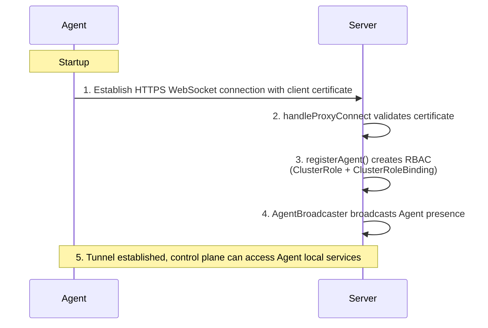
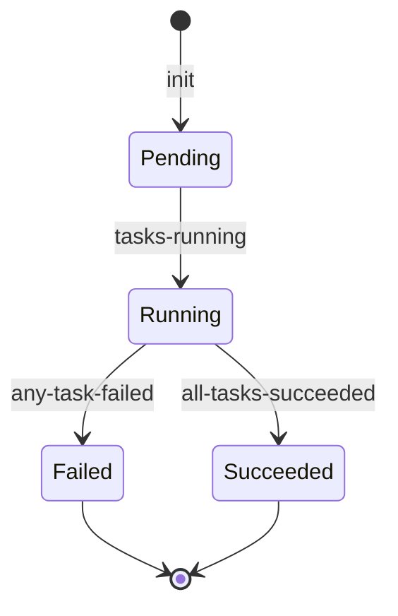
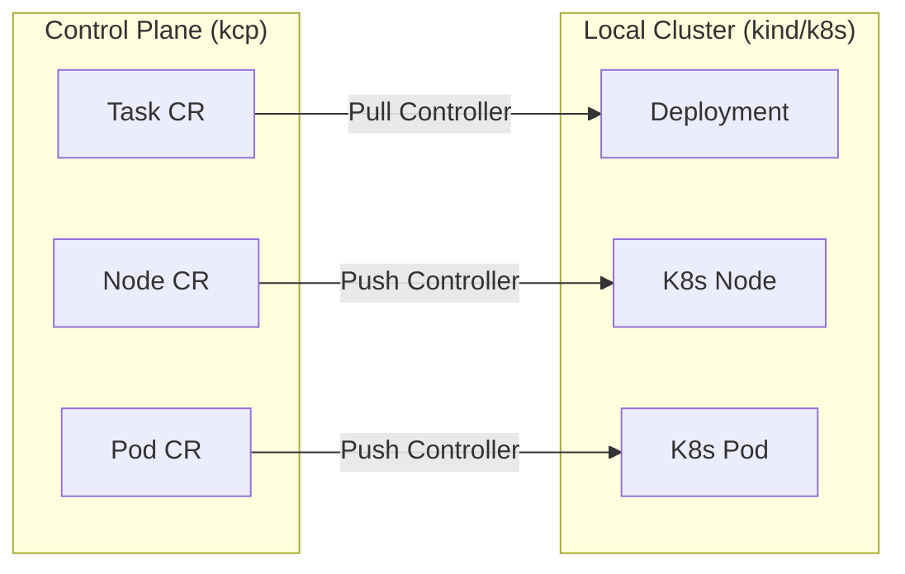
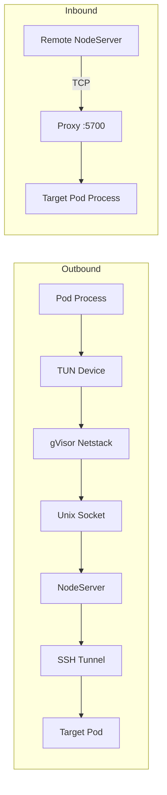
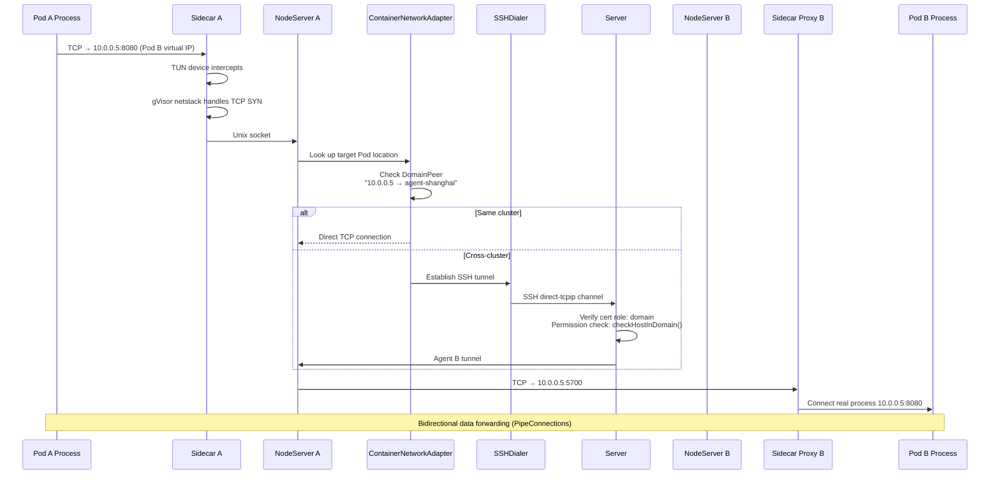
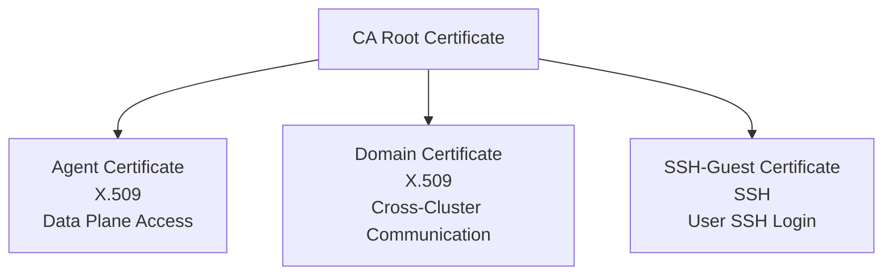
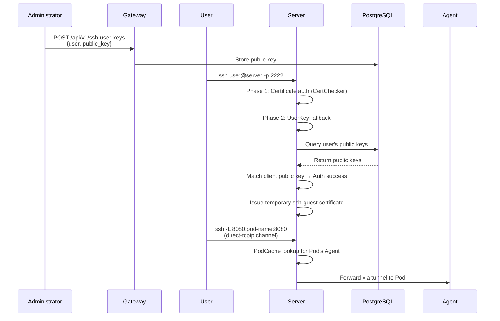
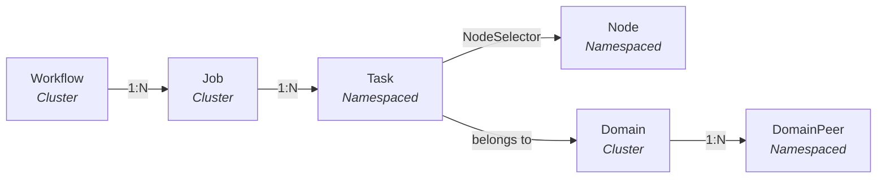

# Technical Architecture

## 1. Design Goals

rlark is an embodied intelligence cloud-native management platform for cross-cluster, multi-runtime scenarios. Core design goals:

1. **Cloud-to-Edge workload orchestration**: From cloud GPU training (RL/LLM) to edge deployment (robot arm, sensor, camera), unified declarative abstraction across the full embodied AI pipeline
2. **Multi-runtime data plane**: Native support for Kubernetes, Docker, and Raw runtimes — GPU clusters run k8s for large-scale training, edge devices run k8s or Docker/Raw for lightweight embodied deployment (Docker/Raw runtimes: framework in place, runtime implementation TODO)
3. **Cross-cluster resource pooling**: Unify GPU clusters and edge devices distributed across different regions into a single logical resource pool
4. **Direct Pod-to-Pod network communication**: Embodied AI workloads require real-time communication between training actors and edge robots, requiring cross-cluster Pods to establish direct TCP connections
5. **Security isolation**: Multi-tenant embodied AI tasks require network isolation — different teams/projects must not access each other's devices or data

## 2. Overall Architecture

rlark uses a **control plane—data plane** separation architecture. The control plane runs on kcp (Kubernetes Control Plane), and data plane Agents are deployed in each GPU cluster or edge device, supporting k8s, Docker, and Raw runtimes. The **embodied-runtime** (Device Plugin + Controllers) runs as a DaemonSet on each data plane node to manage robot (ROS 1/2) and camera hardware, exposing them as Kubernetes device resources.


## 3. Control Plane Components

### 3.1 Server

Server is the core of the control plane, responsible for managing all Agent and external client connections.

**Key Responsibilities**:

| Function                | Implementation                                                                                | Key File                                                     |
| ----------------------- | --------------------------------------------------------------------------------------------- | ------------------------------------------------------------ |
| Agent Tunnel Management | Reverse proxy based on remotedialer; Agent actively connects to Server via WebSocket          | [handle\_proxy.go](../../pkg/server/handle_proxy.go)         |
| Certificate Signing     | X.509 and SSH certificate issuance/revocation, supporting agent/domain/ssh-guest roles        | [sign.go](../../pkg/server/sign.go)                          |
| SSH Service             | Two-phase user SSH authentication (certificate + public key), direct-tcpip channel forwarding | [ssh\_server.go](../../pkg/server/ssh_server.go)             |
| Peer Interconnection    | Server-to-Server P2P connections for high availability                                        | [peer\_manager.go](../../pkg/server/peer_manager.go)         |
| K8s Proxy               | Forward K8s API requests to data plane clusters via Agent tunnels                             | [kube\_proxy.go](../../pkg/server/kube_proxy.go)             |
| Pod Cache               | In-memory Pod cache based on Informer for fast SSH Pod lookup                                 | [caches/pod\_cache.go](../../pkg/server/caches/pod_cache.go) |

**Agent Connection Lifecycle**:



### 3.2 Gateway

Gateway is the user-facing HTTP API gateway providing RESTful interfaces.

**Key Responsibilities**:

| Function               | Route                                                            | File                                                  |
| ---------------------- | ---------------------------------------------------------------- | ----------------------------------------------------- |
| CRD CRUD               | `GET/POST/PUT/PATCH/DELETE /api/v1/rlinf.io/v1alpha1/{resource}` | [router.go](../../pkg/gateway/router.go)              |
| Certificate Management | `POST /api/v1/certificates/agent`                                | [cert\_handler.go](../../pkg/gateway/cert_handler.go) |
| SSH Keys               | `GET/POST/DELETE /api/v1/ssh-user-keys`                          | [suk\_handler.go](../../pkg/gateway/suk_handler.go)   |
| Pod Logs               | `GET /api/v1/.../jobs/:name/logs`                                | [job\_logs.go](../../pkg/gateway/job_logs.go)         |
| Prometheus Metrics     | Middleware                                                       | [metrics.go](../../pkg/gateway/metrics.go)            |

### 3.3 Controller-Manager

Controller-Manager runs in the control plane, coordinating the lifecycle of high-level resources.

**Controller List**:

| Controller          | Responsibility                                                               | Key File                                           |
| ------------------- | ---------------------------------------------------------------------------- | -------------------------------------------------- |
| Job Controller      | Split Job into Tasks, drive state machine (Pending→Running→Succeeded/Failed) | [job/](../../pkg/controllermanager/job/)           |
| Domain Controller   | Manage Domain CRD, allocate IP subnets, sign DomainPeer certificates         | [domain/](../../pkg/controllermanager/domain/)     |
| Task Controller     | Watch Task status, sync to corresponding Job                                 | [task/](../../pkg/controllermanager/task/)         |
| Node Controller     | Watch Node registration/offline events                                       | [node/](../../pkg/controllermanager/node/)         |
| Workflow Controller | DAG orchestration, schedule Jobs in dependency order                         | [workflow/](../../pkg/controllermanager/workflow/) |

**Job State Machine**:



## 4. Data Plane Components

### 4.1 Agent

Agent is deployed in each data plane cluster with two operating modes:

| Mode      | Component    | Responsibility                                                                                                                   |
| --------- | ------------ | -------------------------------------------------------------------------------------------------------------------------------- |
| `cluster` | clusterAgent | Resource sync: Pull controllers (control plane CR → local k8s resources) + Push controllers (local k8s state → control plane CR) |
| `node`    | nodeAgent    | Network routing: Runs NodeServer, handles cross-cluster Pod traffic forwarding                                                   |

**clusterAgent Controllers**:



**Pull Controller** (Task example):

1. Watch control plane Task CR create/update/delete events (with finalizer protection)
2. Build corresponding K8s resources (Deployment/DaemonSet/StatefulSet) from Task.Spec
3. Detect ResourceVersion changes to decide whether to update existing workloads
4. Auto-inject Network Sidecar container and Ray initialization scripts
5. On deletion, clean up local resources via finalizer then remove finalizer

**Push Controller**:

1. Watch local K8s resource changes (Pod create/delete/status changes)
2. Sync state to corresponding control plane Pod CR
3. Periodically report Node info (addresses, capacity, GPU count)

### 4.2 Network Sidecar

Sidecar is injected as a container into each training Pod, enabling cross-cluster Pod-to-Pod network communication.

**Key File**: [sidecar/server.go](../../pkg/network/sidecar/server.go)

**Dual Role**:



**Startup Process**:

1. Obtain virtual IP and subnet prefix from NodeServer's `/get_ip` endpoint
2. Start Proxy listener (`:5700`) to receive forwarded connections from other Pods
3. Create TUN device + gVisor netstack to intercept Pod outbound traffic
4. Send outbound traffic to NodeServer via Unix socket for routing

### 4.3 NodeServer

NodeServer runs on each node (managed by nodeAgent), handling node-level network routing.

**Key File**: [nodeserver/server.go](../../pkg/network/nodeserver/server.go)

**Core Functions**:

- Accept Unix socket connections from Sidecar, parse target addresses
- Call `ContainerNetworkAdapter` to locate target Pod across all DomainPeers
- Same cluster: direct TCP connection to target Pod's Proxy
- Cross-cluster: SSH tunnel through Server, then forward to target Agent's NodeServer

### 4.4 ContainerNetworkAdapter

**Key File**: [container/network.go](../../pkg/agent/container/network.go)

**Routing Decision**:

```go
func (a *containerNetworkAdapter) GetContainerNetworkDial(...) (utils.Dial, error) {
    // 1. Same cluster → direct TCP to target Pod's Proxy
    if targetPod.GlobalNamespace == a.globalNamespace {
        return dialer.DialContext("tcp", targetPod.LocalIP + ":57")
    }
    // 2. Cross-cluster → SSH tunnel
    return a.sshDialer.DialContext(ctx, domainID, sshAddr, cert, key, target)
}
```

### 4.5 SSHDialer

**Key File**: [container/ssh\_dialer.go](../../pkg/agent/container/ssh_dialer.go)

Per-Domain SSH connection pool. Design highlights:

- At most one SSH connection per Domain (ssh.Client multiplexing)
- Auto-reconnect on disconnect; concurrent requests wait during reconnection instead of creating separate connections
- Exponential backoff on reconnection failure (1s → 2s → 4s → ... → 30s)
- Background GC closes idle connections (default 10 min timeout)
- Thread-safe; read lock on normal path, no blocking

### 4.6 Embodied Runtime

The **embodied-runtime** is a node-level component deployed as a DaemonSet on each data plane node, managing robot (ROS 1/2) and camera hardware. It integrates with the Agent to expose physical devices as Kubernetes device resources (`rlinf.io/device`), allowing training Tasks to request robot arms and cameras just like GPU resources.

**Key Files**: [apps/embodied-runtime/](../../../embodied-runtime/)

**Component Overview**:

| Component | Responsibility | Key File |
|-----------|---------------|----------|
| Device Plugin | Registers `rlinf.io/device` with kubelet; detects node-local hardware; injects sockets and CLI binaries into Task Pods | [plugin.go](../../../../embodied-runtime/pkg/deviceplugin/plugin.go) |
| Mutating Webhook | Auto-injects `devinit` init container into Pods requesting `rlinf.io/device`; manages CA certificate and serving certificate | [webhook.go](../../../../embodied-runtime/pkg/deviceplugin/webhook.go) |
| ros-controller | Manages ROS 1 (`roscore` + `roslaunch`) robot lifecycle; exposes gRPC API via Unix socket | [roscontroller/](../../../../embodied-runtime/pkg/roscontroller/) |
| ros2-controller | Manages ROS 2 robot lifecycle; exposes gRPC API via Unix socket | [ros2controller/](../../../../embodied-runtime/pkg/ros2controller/) |
| camera-controller | Manages camera (V4L2 / RTSP / RealSense) lifecycle; ffmpeg transcoding; exposes gRPC API via Unix socket | [cameracontroller/](../../../../embodied-runtime/pkg/cameracontroller/) |
| CLI (rosctr / camctr) | Command-line tools mounted into Task Pods for direct robot/camera control | [cmd/rosctr/](../../../../embodied-runtime/cmd/rosctr/) |

**Device Lifecycle**:

1. Device Plugin detects hardware (V4L2 cameras, robot controllers) and registers them with kubelet
2. Task Pod requests `rlinf.io/device` resources in its spec
3. **Mutating Webhook** intercepts the Pod creation and auto-injects a `devinit` init container (requesting the same resource) that runs `devinit setup` to create macvlans in the Pod's network namespace
4. On Allocate, Device Plugin injects Unix sockets and CLI binaries into the Pod
5. The task container communicates with ros-controller / camera-controller via gRPC over Unix sockets
6. On Pod termination, Device Plugin cleans up and returns the device to the pool

## 5. Cross-Cluster Pod Network Data Flow

Pod A (Cluster Beijing) accessing Pod B (Cluster Shanghai):



## 6. Security System

### 6.1 Certificate Hierarchy



### 6.2 Permission Model

| Certificate Role | Permissions                                                                 |
| ---------------- | --------------------------------------------------------------------------- |
| `agent`          | Connect to Server tunnel, proxy K8s API requests                            |
| `domain`         | Access Pods in the same Domain, establish cross-cluster network connections |
| `ssh-guest`      | SSH login to authorized Pods                                                |
| `admin`          | Issue/revoke certificates, Kubernetes impersonation                         |

### 6.3 User SSH Login Flow



## 7. CRD Resource Model



## 8. Key Design Decisions

### 8.1 Why kcp instead of native k8s API Server?

kcp is more lightweight than a native k8s API Server and can run independently without a full Kubernetes cluster, reducing the control plane's resource overhead and operational complexity. Additionally, kcp's native logical cluster concept aligns naturally with rlark's Domain concept, leaving room for future multi-tenant scenarios.

### 8.2 Why SSH tunnels instead of VPN?

VPN solutions require opening the underlying network, which is complex in heterogeneous cluster environments. SSH tunnel approach:

- TCP-based, no network infrastructure changes needed
- Fine-grained permission control via SSH certificates (one certificate per Domain)
- Connection multiplexing (ssh.Client multiplexing) reduces handshake overhead
- Native support for user authentication (SSH public key login)

### 8.3 Why TUN + gVisor instead of iptables/CNI?

iptables/CNI solutions require modifying node network configuration with high privilege requirements. TUN + gVisor approach:

- Runs in userspace; gVisor netstack supports full TCP/UDP/ICMP protocol family (note: creating TUN devices requires privileged access)
- gVisor netstack supports full TCP/UDP/ICMP protocol family
- Can be injected as a Sidecar container, decoupled from business containers

