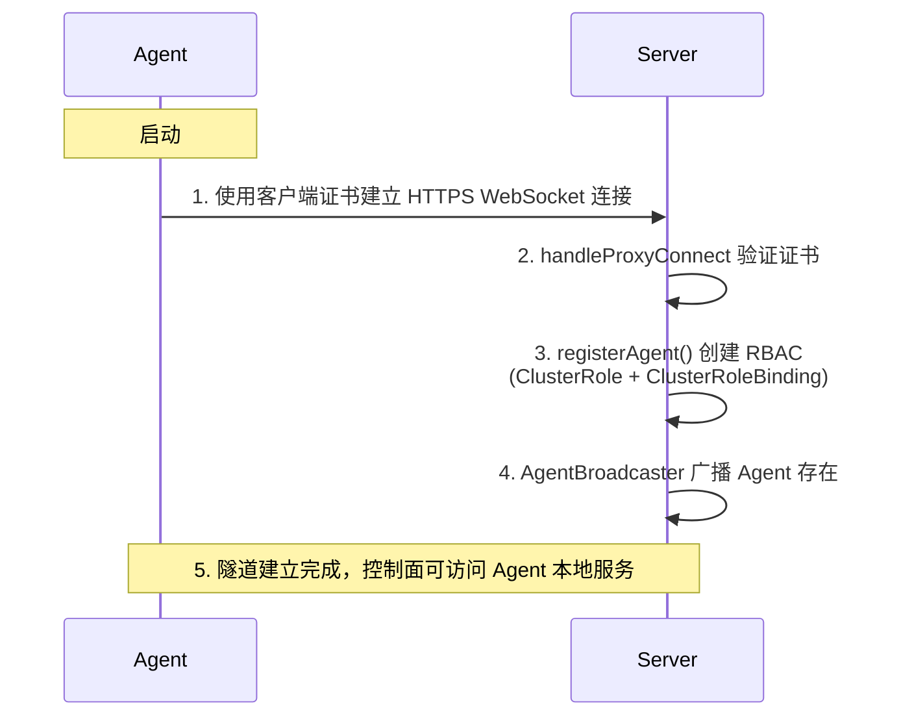
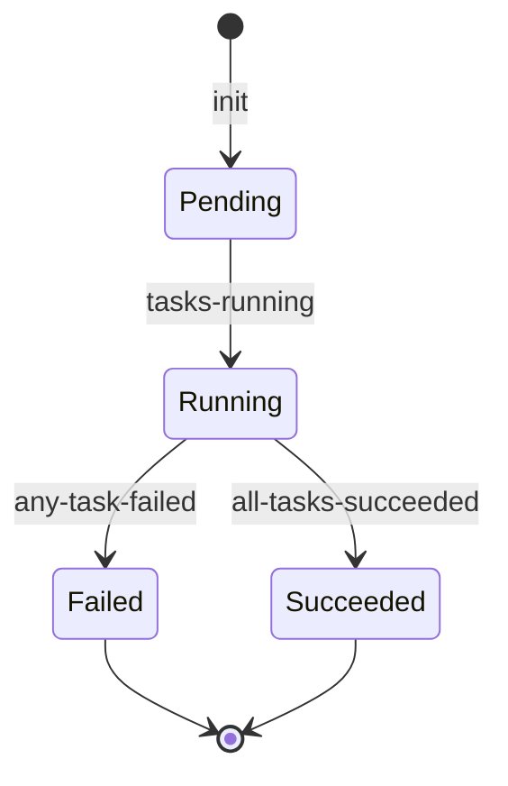
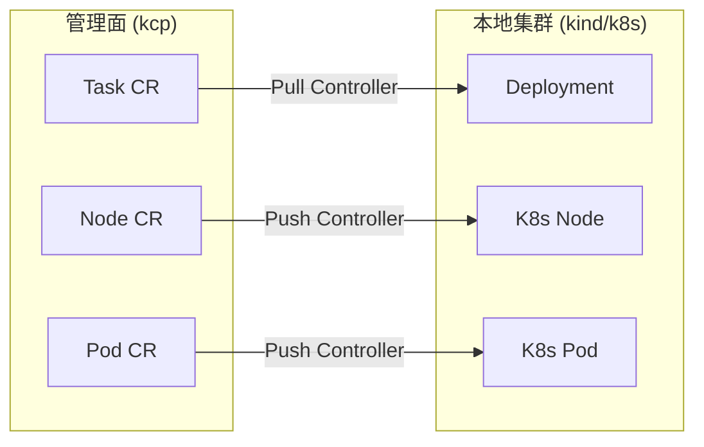
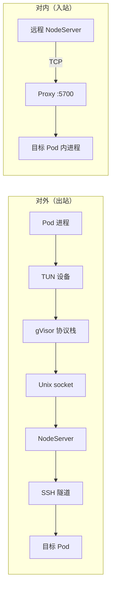
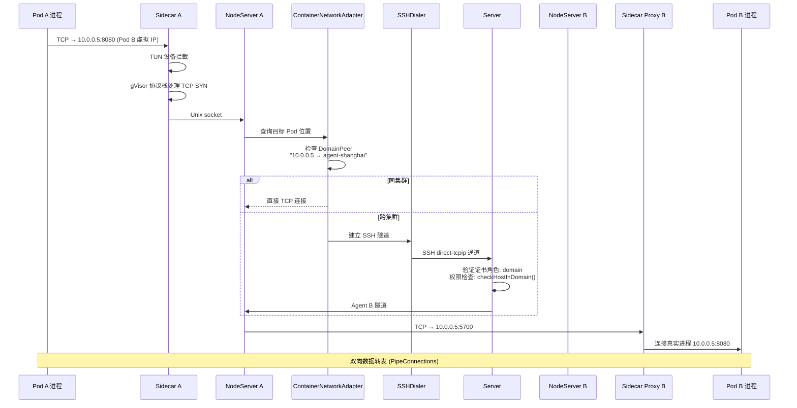
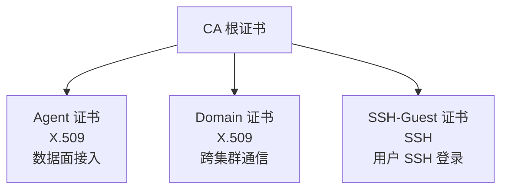
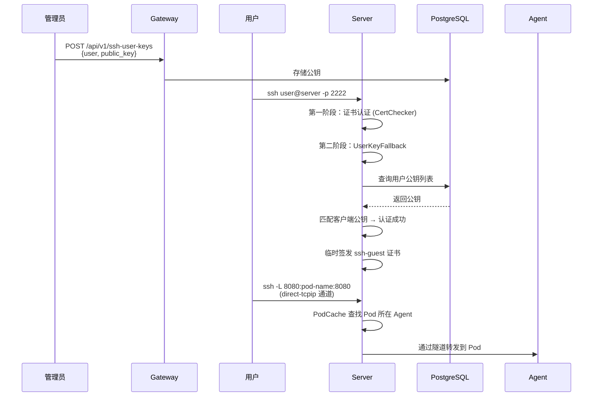
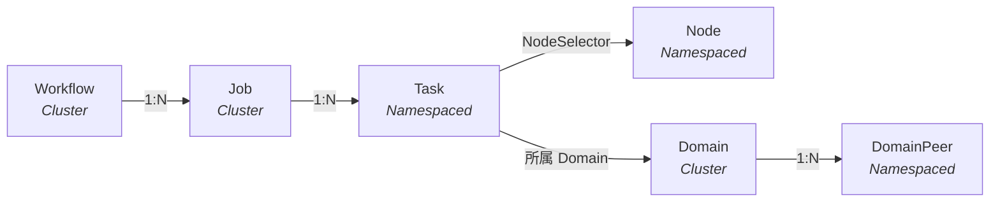

# 技术架构

## 1. 设计目标

rlark 是一个面向跨集群具身智能场景的云原生纳管平台，核心设计目标：

1. **云端到端侧的工作负载编排**：从云端 GPU 训练（RL/LLM）到端侧部署（机械臂、传感器、摄像头），统一的声明式抽象覆盖具身智能全链路
2. **多运行时数据面**：原生支持 Kubernetes、Docker、Raw 三种运行时 — GPU 集群运行 k8s 承载大规模训练，端侧设备运行 k8s 或 Docker/Raw 实现轻量级具身部署（Docker/Raw 运行时：代码框架已就绪，运行时实现尚为 TODO）
3. **跨集群资源池化**：将分布在不同地域的 GPU 集群和端侧设备统一管理，形成逻辑上的单一资源池
4. **Pod 间直接网络通信**：具身智能场景中训练进程与端侧机器人之间需要实时通信，要求跨集群 Pod 能够直接建立 TCP 连接
5. **安全隔离**：多租户下的具身智能任务需要网络隔离，不同团队/项目的设备和数据不能互相访问

## 2. 总体架构

rlark 采用**控制面—数据面**分离架构，控制面基于 kcp（Kubernetes Control Plane）运行，数据面 Agent 部署在每个 GPU 集群或端侧设备中，支持 k8s、Docker 和 Raw 三种运行时。**embodied-runtime**（Device Plugin + Controllers）以 DaemonSet 形式运行在每个数据面节点上，管理机械臂（ROS 1/2）和摄像头硬件，将其作为 Kubernetes 设备资源暴露。


## 3. 控制面组件

### 3.1 Server

Server 是控制面核心，负责所有 Agent 和外部客户端的连接管理。

**关键职责**：

| 功能         | 实现                                                      | 关键文件                                                         |
| ---------- | ------------------------------------------------------- | ------------------------------------------------------------ |
| Agent 隧道管理 | 基于 remotedialer 的反向代理，Agent 主动连接 Server 建立 WebSocket 隧道 | [handle\_proxy.go](../../pkg/server/handle_proxy.go)         |
| 证书签发       | X.509 和 SSH 证书的签发/吊销，支持 agent/domain/ssh-guest 等角色      | [sign.go](../../pkg/server/sign.go)                          |
| SSH 服务     | 用户 SSH 登录认证（证书 + 公钥两阶段），direct-tcpip 通道转发               | [ssh\_server.go](../../pkg/server/ssh_server.go)             |
| Peer 互联    | Server 间 Peer-to-Peer 连接，支持多 Server 高可用                 | [peer\_manager.go](../../pkg/server/peer_manager.go)         |
| K8s 代理     | 将 K8s API 请求通过 Agent 隧道转发到数据面集群                         | [kube\_proxy.go](../../pkg/server/kube_proxy.go)             |
| Pod 缓存     | 基于 Informer 的内存 Pod 缓存，用于 SSH 快速查找目标 Pod                | [caches/pod\_cache.go](../../pkg/server/caches/pod_cache.go) |

**Agent 连接生命周期**：



### 3.2 Gateway

Gateway 是面向用户的 HTTP API 网关，提供 RESTful 接口。

**关键职责**：

| 功能       | 路由                                                               | 文件                                                    |
| -------- | ---------------------------------------------------------------- | ----------------------------------------------------- |
| CRD CRUD | `GET/POST/PUT/PATCH/DELETE /api/v1/rlinf.io/v1alpha1/{resource}` | [router.go](../../pkg/gateway/router.go)              |
| 证书管理     | `POST /api/v1/certificates/agent`                                | [cert\_handler.go](../../pkg/gateway/cert_handler.go) |
| SSH 密钥   | `GET/POST/DELETE /api/v1/ssh-user-keys`                          | [suk\_handler.go](../../pkg/gateway/suk_handler.go)   |
| Pod 日志   | `GET /api/v1/.../jobs/:name/logs`                                | [job\_logs.go](../../pkg/gateway/job_logs.go)         |
| 监控指标     | Prometheus middleware                                            | [metrics.go](../../pkg/gateway/metrics.go)            |

### 3.3 Controller-Manager

Controller-Manager 运行在控制面，负责协调高层资源的生命周期。

**控制器列表**：

| 控制器                 | 职责                                                      | 关键文件                                               |
| ------------------- | ------------------------------------------------------- | -------------------------------------------------- |
| Job Controller      | 将 Job 拆分为 Task，驱动状态机 (Pending→Running→Succeeded/Failed) | [job/](../../pkg/controllermanager/job/)           |
| Domain Controller   | 管理 Domain CRD，分配 IP 子网，签发 DomainPeer 证书                 | [domain/](../../pkg/controllermanager/domain/)     |
| Task Controller     | 监听 Task 状态，同步到对应的 Job                                   | [task/](../../pkg/controllermanager/task/)         |
| Node Controller     | 监听 Node 注册/离线事件                                         | [node/](../../pkg/controllermanager/node/)         |
| Workflow Controller | DAG 编排，按依赖顺序调度 Job                                      | [workflow/](../../pkg/controllermanager/workflow/) |

**Job 状态机**：



## 4. 数据面组件

### 4.1 Agent

Agent 部署在每个数据面集群中，有两种运行模式：

| 模式        | 组件           | 职责                                                              |
| --------- | ------------ | --------------------------------------------------------------- |
| `cluster` | clusterAgent | 资源同步：Pull 控制器（管理面 CR → 本地 k8s 资源）+ Push 控制器（本地 k8s 状态 → 管理面 CR） |
| `node`    | nodeAgent    | 网络路由：运行 NodeServer，处理跨集群 Pod 流量转发                               |

**clusterAgent 控制器**：



**Pull 控制器**（以 Task 为例）：

1. 监听管理面 Task CR 的创建/更新/删除（带 finalizer 保护）
2. 根据 Task.Spec 构建对应的 K8s 资源（Deployment/DaemonSet/StatefulSet）
3. 检测 ResourceVersion 变化决定是否需要更新已有 workload
4. 自动注入 Network Sidecar 容器和 Ray 初始化脚本
5. 删除时通过 finalizer 清理本地资源后移除 finalizer

**Push 控制器**：

1. 监听本地 K8s 资源变化（Pod 创建/删除/状态变更）
2. 将状态同步到管理面对应的 Pod CR
3. Node 信息（地址、容量、GPU 数量）定期上报

### 4.2 Network Sidecar

Sidecar 以容器形式注入到每个训练 Pod 中，实现跨集群 Pod 间网络通信。

**关键文件**：[sidecar/server.go](../../pkg/network/sidecar/server.go)

**双重角色**：



**启动流程**：

1. 通过 NodeServer 的 `/get_ip` 端点获取本 Pod 的虚拟 IP 和子网前缀
2. 启动 Proxy 监听（`:5700`），接收其他 Pod 的转发连接
3. 创建 TUN 设备 + gVisor 协议栈，拦截 Pod 出站流量
4. 出站流量通过 Unix socket 发送给 NodeServer 路由

### 4.3 NodeServer

NodeServer 运行在每个节点上（由 nodeAgent 管理），负责节点级网络路由。

**关键文件**：[nodeserver/server.go](../../pkg/network/nodeserver/server.go)

**核心功能**：

- 接收 Sidecar 的 Unix socket 连接，解析目标地址
- 调用 `ContainerNetworkAdapter` 查找目标 Pod 在所有 DomainPeer 中的位置
- 同集群：直接 TCP 连接目标 Pod 的 Proxy
- 跨集群：通过 SSH 隧道连接 Server，再由 Server 转发到目标 Agent 的 NodeServer

### 4.4 ContainerNetworkAdapter

**关键文件**：[container/network.go](../../pkg/agent/container/network.go)

**路由决策**：

```go
func (a *containerNetworkAdapter) GetContainerNetworkDial(...) (utils.Dial, error) {
    // 1. 同集群 → 直接 TCP 连接目标 Pod 的 Proxy
    if targetPod.GlobalNamespace == a.globalNamespace {
        return dialer.DialContext("tcp", targetPod.LocalIP + ":57")
    }
    // 2. 跨集群 → SSH 隧道
    return a.sshDialer.DialContext(ctx, domainID, sshAddr, cert, key, target)
}
```

### 4.5 SSHDialer

**关键文件**：[container/ssh\_dialer.go](../../pkg/agent/container/ssh_dialer.go)

按 Domain 维护的 SSH 连接池，设计要点：

- 每个 Domain 至多一个 SSH 连接（ssh.Client 多路复用）
- 连接断开时自动重连，重连期间并发请求等待而非各自新建
- 重连失败指数退避（1s → 2s → 4s → ... → 30s）
- 后台 GC 关闭空闲超时连接（默认 10 分钟）
- 线程安全，正常路径读锁无阻塞

### 4.6 Embodied Runtime

**embodied-runtime** 是部署在每个数据面节点上的 DaemonSet 组件，管理机械臂（ROS 1/2）和摄像头硬件。它与 Agent 集成，将物理设备作为 Kubernetes 设备资源（`rlinf.io/device`）暴露，使训练 Task 可以像申请 GPU 一样申请机械臂和摄像头。

**关键文件**：[apps/embodied-runtime/](../../../embodied-runtime/)

**组件概览**：

| 组件 | 职责 | 关键文件 |
|-----------|---------------|----------|
| Device Plugin | 向 kubelet 注册 `rlinf.io/device`；检测节点本地硬件；向 Task Pod 注入 socket 和 CLI 二进制 | [plugin.go](../../../../embodied-runtime/pkg/deviceplugin/plugin.go) |
| Mutating Webhook | 自动向申请 `rlinf.io/device` 的 Pod 注入 `devinit` init 容器；管理 CA 证书和 serving 证书 | [webhook.go](../../../../embodied-runtime/pkg/deviceplugin/webhook.go) |
| ros-controller | 管理 ROS 1（`roscore` + `roslaunch`）机器人生命周期；通过 Unix socket 暴露 gRPC API | [roscontroller/](../../../../embodied-runtime/pkg/roscontroller/) |
| ros2-controller | 管理 ROS 2 机器人生命周期；通过 Unix socket 暴露 gRPC API | [ros2controller/](../../../../embodied-runtime/pkg/ros2controller/) |
| camera-controller | 管理摄像头（V4L2 / RTSP / RealSense）生命周期；ffmpeg 转码；通过 Unix socket 暴露 gRPC API | [cameracontroller/](../../../../embodied-runtime/pkg/cameracontroller/) |
| CLI（rosctr / camctr） | 挂载到 Task Pod 中的命令行工具，用于直接控制机器人/摄像头 | [cmd/rosctr/](../../../../embodied-runtime/cmd/rosctr/) |

**设备生命周期**：

1. Device Plugin 检测硬件（V4L2 摄像头、机器人控制器）并向 kubelet 注册
2. Task Pod 在 spec 中申请 `rlinf.io/device` 资源
3. **Mutating Webhook** 拦截 Pod 创建请求，自动注入 `devinit` init 容器（申请同一资源），执行 `devinit setup` 在 Pod 网络命名空间中创建 macvlan
4. Allocate 时，Device Plugin 将 Unix socket 和 CLI 二进制注入 Pod
5. 任务容器通过 gRPC over Unix socket 与 ros-controller / camera-controller 通信
6. Pod 终止时，Device Plugin 清理并归还设备到资源池

## 5. 跨集群 Pod 网络数据流

以 Pod A（集群北京）访问 Pod B（集群上海）为例：



## 6. 安全体系

### 6.1 证书层次



### 6.2 权限模型

| 证书角色        | 权限                               |
| ----------- | -------------------------------- |
| `agent`     | 接入 Server 隧道，代理 K8s API 请求       |
| `domain`    | 访问同 Domain 下的 Pod，建立跨集群网络连接      |
| `ssh-guest` | 通过 SSH 登录到有权限的 Pod               |
| `admin`     | 签发/吊销证书，Kubernetes impersonation |

### 6.3 用户 SSH 登录流程



## 7. CRD 资源模型



## 8. 关键设计决策

### 8.1 为什么用 kcp 而不是原生 k8s API Server？

kcp 相比原生 k8s API Server 更加轻量，可以脱离完整的 Kubernetes 集群独立部署，降低了控制面的资源开销和运维复杂度。同时 kcp 原生的逻辑集群（logical cluster）概念与 rlark 的 Domain 概念天然契合，为未来多租户场景预留了扩展性。

### 8.2 为什么用 SSH 隧道而不是 VPN？

VPN 方案需要开放底层网络，在异构集群环境下配置复杂。SSH 隧道方案：

- 基于 TCP，无需修改网络基础设施
- 利用 SSH 证书实现细粒度权限控制（每个 Domain 独立证书）
- 连接复用（ssh.Client 多路复用），减少握手开销
- 天然支持用户认证（SSH 公钥登录）

### 8.3 为什么用 TUN + gVisor 而不是 iptables/CNI？

iptables/CNI 方案需要修改节点网络配置，权限要求高。TUN + gVisor 方案：

- 运行在用户态，gVisor 协议栈支持 TCP/UDP/ICMP 完整协议族（注：创建 TUN 设备需要 privileged 权限）
- gVisor 协议栈支持 TCP/UDP/ICMP 完整协议族
- 可以作为 Sidecar 容器注入，与业务容器解耦

