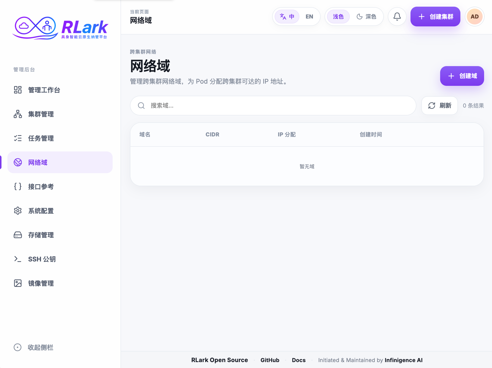

# Quick Start

!!! warning "Development version"
    RLark does not currently have a stable release. These instructions target the latest `main` branch, which is a development snapshot and may change without backward-compatibility guarantees. Clone or update `main` and build all components from the same commit.

Choose one of two approaches to complete the minimum RLark lifecycle:

| Approach | Description | Best for |
|----------|-------------|----------|
| [**A: One-Click Deployment (CLI)**](#a-one-click-deployment-cli) | One script deploys everything: control plane, data plane, cross-cluster test | Quick evaluation, CI/CD |
| [**B: UI-based (Interactive)**](#b-ui-based-interactive) | Start control plane + UI, then use the admin console to onboard clusters and create jobs | Understanding the workflow, demos |

---

## Environment Requirements

| Tool | Version | Purpose |
|------|---------|---------|
| Docker | >= 24.0 | Run containers |
| kind | >= 0.20 | Run local k8s data plane |
| kubectl | >= 1.28 | Interact with clusters |
| jq | >= 1.6 | Parse JSON |
| python3 | >= 3.8 | Process kubeconfig |
| node + npm | >= 18 | UI dev server (Method B only) |

Root access is not required. Your user must be able to access the Docker daemon (for example, through membership in the platform's Docker group or Docker Desktop). Verify access before starting:

```bash
docker info
```

If this fails with a permission error, fix Docker access according to your operating system's guidance rather than running the entire quick start with `sudo`.

### Recover from a Failed Run

The scripts clean resources left by a previous run when started again. After fixing the reported problem, rerun the same script. If automatic cleanup cannot proceed, clean the local environment first:

```bash
docker compose -f apps/rlark/docs/examples/docker-compose.yml down -v
kind delete cluster --name rlark-data-1
kind delete cluster --name rlark-data-2
docker rm -f local-registry
rm -rf /tmp/rlark /tmp/kind-kubeconfig-*
```

Cleanup commands can report that absent resources were not found; that is safe to ignore. These commands remove Quick Start state, including the local PostgreSQL volume, so do not use them for an environment whose data you need to retain.

---

## A: One-Click Deployment (CLI)

One script builds images, starts the control plane, creates kind clusters, deploys agents, and runs a cross-cluster connectivity test.

### 1. Run the Script

```bash
bash apps/rlark/docs/examples/quickstart.sh
```

The script completes these steps:

| Step | Description |
|------|-------------|
| 0 | Check prerequisites |
| 1 | Create runtime directory `/tmp/rlark` |
| 2 | Start local Docker registry |
| 3 | Build 5 binaries, create Docker image, push to local registry |
| 4 | Ensure kind node image |
| 5 | Start kcp and PostgreSQL |
| 6 | Configure kubeconfig, install CRDs, create UI credentials |
| 7 | Start control plane (server, gateway, controller-manager) |
| 8 | Create kind clusters (`rlark-data-1`, `rlark-data-2`) |
| 9 | Deploy agents (certificates, RBAC, agent deployment) |
| 10 | Verify node registration |
| 11 | Create cross-cluster test resources (Workspace, Domain, Job) |
| 12 | Verify cross-cluster network connectivity |

### 2. Sign in to the UI

After the script completes, start the UI locally:

```bash
cd apps/rlark-ui
npm install
VITE_DATA_MODE=backend npm run dev
```

Open `http://localhost:5173/admin`. Use the credentials from the script output:

| Service | URL | Purpose |
|---------|-----|---------|
| Admin Console | `http://localhost:5173/admin` | Cluster onboarding, nodes, certificates |
| Platform | `http://localhost:5173` | Jobs, Workers, Workflows, storage |
| Gateway API | `http://localhost:9000` | Automation |

### 3. Clean Up

```bash
docker compose -f apps/rlark/docs/examples/docker-compose.yml down
kind delete cluster --name rlark-data-1
kind delete cluster --name rlark-data-2
docker rm -f local-registry
rm -rf /tmp/rlark /tmp/kind-kubeconfig-*
```

---

## B: UI-based (Interactive)

This approach separates the control plane and data plane, letting you use the admin console to create clusters and the platform to submit jobs.

### 1. Start the Control Plane and UI

```bash
bash apps/rlark/docs/examples/quickstart-cp.sh
```

This script:
- Builds and pushes Docker images
- Starts kcp, PostgreSQL, and the control plane (server, gateway, controller-manager)
- Starts the UI dev server at `http://localhost:5173`
- Prints admin credentials

!!! tip "Keep the terminal open"
    The UI dev server runs in the foreground. Keep this terminal open while you use the UI. Press `Ctrl+C` to stop the UI when done.

The output shows:

```
Control plane:
  kcp:                      localhost:6443
  rlark-server:             localhost:8443
  rlark-gateway (REST API): localhost:9000
  UI (admin console):       http://localhost:5173/admin
  UI (platform):            http://localhost:5173

Credentials:
  admin / <random-password>
  user  / <random-password>

Next steps:
  1. Open http://localhost:5173/admin and sign in as admin
  2. Go to Cluster Management → Create Cluster
  3. Enter a cluster name (e.g. my-cluster) and create it
  4. Copy the cluster name and run: bash quickstart-dp.sh --cluster-id=my-cluster
  5. Return to the UI to create domains and submit jobs
```

### 2. Create a Cluster in the Admin Console

1. Open `http://localhost:5173/admin` and sign in as `admin`
2. Navigate to **Cluster Management** → **Create Cluster**
3. Enter a cluster name (e.g. `my-cluster`)
4. Click **Sign Certificate** — the UI shows the Server address and complete `DeployConfig` YAML
5. Keep the entered cluster name for the next step (e.g. `my-cluster`)

### 3. Deploy the Data Plane

Run the data plane script with the cluster name from step 2:

```bash
bash apps/rlark/docs/examples/quickstart-dp.sh --cluster-id my-cluster
```

This script:
- Creates a kind cluster
- Requests an agent certificate from the Gateway for the given cluster-id (no need for the `deploy-conf.yaml` from the UI)
- Deploys the agent with the certificate
- Verifies node registration

!!! note "About deploy-conf.yaml"
    The `deploy-conf.yaml` shown in the UI after creating a cluster is for **manual deployment** (e.g., on a real cluster). The script automatically requests certificates from the Gateway API, so this file is not needed.

To deploy multiple data plane clusters, create them in the UI first, then pass all cluster-ids to a single script invocation:

```bash
# Create cluster-1 and cluster-2 in the UI, then:
bash apps/rlark/docs/examples/quickstart-dp.sh \
  --cluster-id my-cluster-1 \
  --cluster-id my-cluster-2
```

### 4. Verify the Cluster and Nodes

**Using the UI:** Admin Console → Clusters and Nodes. Verify both clusters are online and their nodes are synchronized.

**Using the API:**

```bash
curl -s "http://localhost:9000/api/v1/rlinf.io/v1alpha1/nodes" | \
  jq '.items[] | {name: .metadata.name, cluster: .metadata.labels["rlark.io/cluster-id"]}'
```

### 5. Create a Job via the UI

1. Open `http://localhost:5173` and sign in as `user`
2. Navigate to **Jobs** → **Create Job**
3. Select **Custom Task** as the job type
4. Add a role named `worker`, set it as **Header**
5. Configure the Worker:
   - **Cluster**: select your cluster
   - **Node count**: 1
   - **Image**: `rayproject/ray:2.9.0-py310`
   - **Run Script**: `echo hello from RLark; sleep 3600`


6. Review the YAML preview and click **Submit**

For a detailed walkthrough, see [RL Training Best Practices](user-guide/best-practices.md).

### 6. Create and Verify Cross-Cluster Networking

With two data plane clusters deployed, complete the UI flow by creating a Domain and verifying cross-cluster Pod communication
by creating a Domain and a multi-cluster Job.

#### 6.1 Create a Domain

1. Sign in to the Admin Console (`http://localhost:5173/admin`)
2. Navigate to **Domain Management** → **Create Domain**



3. Enter a name and CIDR (e.g. `cross-cluster-net`, `10.200.0.0/24`)

#### 6.2 Create a Cross-Cluster Job

1. Open `http://localhost:5173` and sign in as `user`
2. Navigate to **Jobs** → **Create Job**
3. Select **Custom Task** as the job type
4. Add two roles:
   - **server**: header role, cluster `rlark-my-cluster-1`, image `rayproject/ray:2.9.0-py310`, run script:
     ```bash
     python -u -m http.server 8000 --bind 0.0.0.0
     ```
   - **client**: cluster `rlark-my-cluster-2`, image `rayproject/ray:2.9.0-py310`, run script: `sleep infinity`
5. In the **Common Config** step, select the Domain you created
6. Review and submit. On the job details page, confirm that Workers are running on the selected nodes.


#### 6.3 Verify Cross-Cluster Connectivity

After the job is running, check the client pod logs to verify it can reach the server:

```bash
# Find the client pod
kubectl --kubeconfig /tmp/kind-kubeconfig-2 get pods -n rlark-system

# Test connectivity from the client pod
kubectl --kubeconfig /tmp/kind-kubeconfig-2 exec -n rlark-system \
  <client-pod-name> -c main -- \
  python -c "import urllib.request; print(urllib.request.urlopen('http://<server-pod-name>.rlark-domain:8000').status)"
```

Expected output: `200`

See [Networking and Security](admin-guide/network-security.md) for details.

### 7. Clean Up

```bash
# Stop control plane and UI
docker compose -f apps/rlark/docs/examples/docker-compose.yml down

# Kill the UI dev server (if running in background)
kill $(lsof -ti:5173) 2>/dev/null || true

# Delete kind clusters
kind delete cluster --name rlark-data-1
kind delete cluster --name rlark-data-2

# Remove local registry
docker rm -f local-registry

# Clean up runtime files
rm -rf /tmp/rlark /tmp/kind-kubeconfig-*
```

---

## Cross-Cluster Networking

For cross-cluster network communication between data plane clusters:

### Agent Configuration

```yaml
spec:
  hostNetwork: true
  hostPID: true
  dnsPolicy: ClusterFirstWithHostNet
  containers:
  - args:
    - "--server-address=https://rlark-server:8443"
    - "--rlark-server-ssh-address=client@rlark-server:2222"
    - "--network-sidecar-image=<image>"
```

### Data Flow

```
Client Pod (cluster-2)                    Server Pod (cluster-1)
  ├── HTTP → Domain IP (10.200.0.x)        ├── Python HTTP server :8000
  ├── gVisor netstack intercepts           │
  ├── TUN device → NodeServer socket       │
  └── NodeServer → SSH tunnel → ──────────→ Proxy → localhost:8000
```

## Next Steps

- Read the [Platform User Guide](user-guide/index.md) for resource and Job operations
- Read the [Administrator Guide](admin-guide/index.md) for production deployment and operations
- Read [Core Concepts](concepts.md) for the resource model and naming conventions
- Read [Deployment Guide](deployment.md) for production deployment and real device onboarding
- Read [RL Training Best Practices](user-guide/best-practices.md) for an end-to-end walkthrough