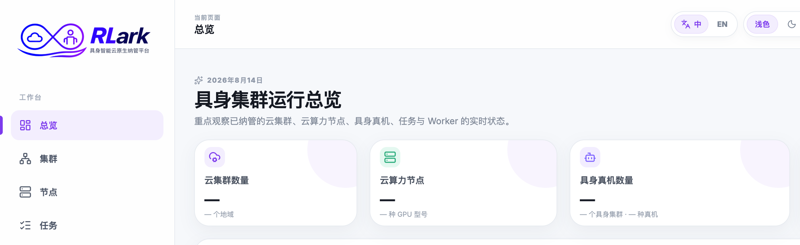

# Console Access and Navigation

## Signing In

RLark has two login entry points:

| Entry | URL | Purpose |
|-------|-----|---------|
| Platform Console | `http://<host>:5173` | Job management, Workers, Workflows, storage, SSH keys |
| Admin Console | `http://<host>:5173/admin` | Cluster onboarding, nodes, certificates, system configuration |

### Login Steps
1. Open the console URL in your browser
2. Enter your username and password
3. Click Login
4. Browser session maintains login state; no Bearer token is issued

## Console Navigation

### Platform Console Pages

| Page | Purpose |
|------|---------|
| Overview | Dashboard summary of clusters, nodes, robots, and running jobs |
| Clusters | Browse and inspect onboarded data-plane clusters |
| Nodes | Filter and inspect node resources, scheduling, and health |
| Jobs | Create, monitor, and manage training jobs |
| Workflows | Create and monitor DAG-based job pipelines |
| Storage | Browse storage classes and object storage |
| SSH Keys | Manage public SSH keys for Worker access |

### Finding the Right Page

| Question | Go to |
|----------|-------|
| Is a cluster or node available for scheduling? | Clusters or Nodes page |
| How to create a training job? | Jobs → Create Job |
| Which stage is a job stuck at? | Job Details → Workers tab |
| How to find application errors? | Job Details → Logs tab |
| How to check resource usage? | Nodes page → Node detail |
| How to open a terminal in a container? | Job Details → Worker → WebTerminal |

## API Equivalent

Supported resource operations are available through the [Gateway API](../api/reference.md). The standalone Gateway defaults to `http://<host>:8080`; an `rlarkadm` deployment uses its configured Service and UI proxy. The API reference is authoritative because not every UI interaction has a one-to-one public endpoint.