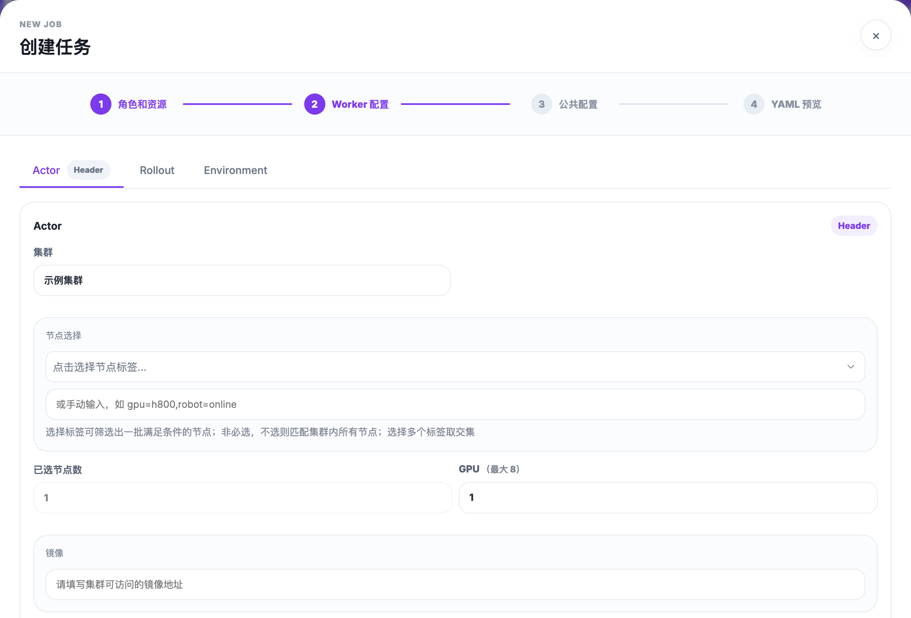
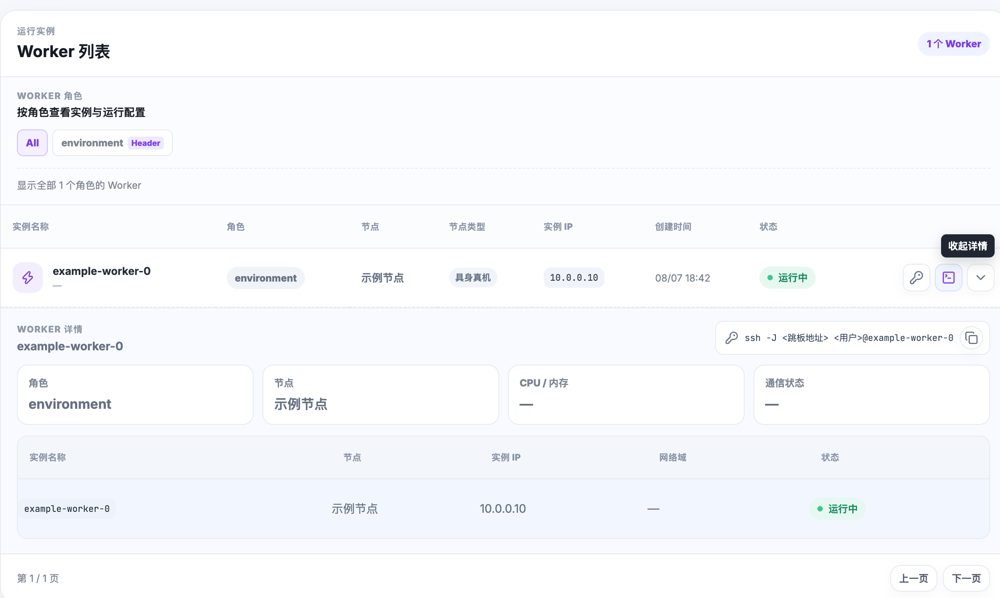
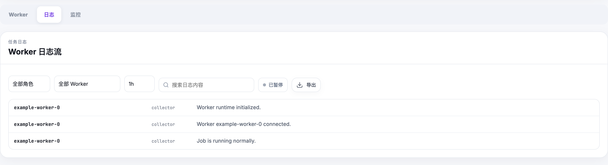

# Jobs

A Job is the user-facing workload. Choose a template or define Task roles, images, commands, replicas, resource requests, storage, and scheduling requirements. After submission, use the Job detail page to follow state changes and inspect its Workers.

Before submitting, confirm that a compatible cluster and node resource are available. See [Core Concepts](../concepts.md) for the Job–Task–Worker relationship.

## Using the UI

Platform Console → Jobs → Create Job. Enter a name and define the Worker roles. For each role:

1. Select the target cluster. Each option shows the cluster name, type label, and current status in one line.
2. Choose one GPU or embodied-device specification from the list, which shows available/total devices and nodes, then set the shared per-Worker resource request. Set the request to `0` for debugging workloads that should keep the placement constraint without requesting the selected device.
3. Choose one scheduling mode:
   - **Automatic selection**: enter the desired Worker count. The console validates the total request against schedulable capacity and selects eligible nodes.
   - **Select nodes**: click eligible nodes or drag across node cards. Each selected node creates one Worker; click or drag across selected nodes again to remove them.
4. Review the shared placement summary, then configure the image, prepare script, environment variables, and storage mounts.

Submit the Job, then open Job details to verify the running state and inspect Workers.

After selecting a role, its resource summary shows the GPU or embodied-device model configured on the assigned node and its requested quantity, such as `NVIDIA RTX 4090 · 1 GPU`. If the Worker has not reported its assigned node yet, the console resolves the model from the role's selected hostname candidates.

When a Worker is Pending, hover or focus the information icon beside that Worker's status. RLark reads events for that exact data-plane Pod, so kubelet `Pulling`/`Pulled` events and image-pull failures appear without mixing in events from other Workers on the same node. Byte or percentage progress is shown only when the runtime reports it; the console never fabricates a progress percentage.

## Job Types

RLark supports the following job types, each pre-configured with default roles tailored to the workload:

- **Reinforcement Learning** — Designed for distributed RL training workflows. Default roles include Actor, Rollout, Environment, and Learner.
- **Data Collection** — Optimized for collecting training data from embodied agents or sensors. Default roles include Collector and Storage.
- **Evaluation** — Runs evaluation and benchmarking against trained models. Default roles include Evaluator and Monitor.
- **Custom Job** — Full flexibility to define your own roles and topology. No default roles are pre-configured.

Each job type pre-configures a set of default roles. You can add, remove, or customize roles to fit your specific training pipeline. Roles define the worker groups that collaborate during training, and each role can have its own container image, resource requirements, and command.

## Worker Configuration

For each worker role, configure the following:

- **Cluster and Node** — Select the target cluster and optionally a specific node. Use the **Node Selector** to filter nodes by attributes such as:
  - Node type: cloud, edge, or robot
  - GPU model (e.g., A100, H100, RTX 4090)
  - Physical location or zone

- **Container Image** — Specify the container image for this role. You can use an image tag (e.g., `myimage:latest`) or a digest (e.g., `myimage@sha256:...`). Using a digest is recommended for reproducibility and auditability.

- **Resource Requests** — Set the CPU, memory, and GPU resources required per worker:
  - CPU: specified in cores (e.g., `4`)
  - Memory: specified in GiB (e.g., `16Gi`)
  - GPU: number of GPUs (e.g., `1`, `2`, `8`)

- **Init Scripts** — Commands that run before the main entrypoint. Useful for environment setup, dependency installation, or data preparation.

- **Storage Mounts** — Attach persistent storage to worker containers. Two types are supported:
  - **hostPath**: Mount a directory from the host node's filesystem. Data persists on the node after the job is deleted.
  - **PVC** (PersistentVolumeClaim): Mount a Kubernetes persistent volume. PVCs are automatically cleaned up when the job is deleted.



## Shared Configuration

Configure settings that apply to all workers in the job:

- **Header Role** — Select one role as the Header role. This role's first worker coordinates the distributed training, and its IP address is communicated to all other workers.

- **Cross-Cluster Network Domain** — When the job spans multiple clusters, select the pre-configured network domain. This enables cross-cluster Pod-to-Pod networking via the RLark virtual network (TUN + gVisor + SSH tunnels).

- **SSH Public Keys** — Provide one or more SSH public keys that will be injected into the `~/.ssh/authorized_keys` of every worker container. This allows you to SSH into running containers for debugging.

- **Run Command** — The main training script or entrypoint command. This is executed after any init scripts complete.

- **TensorBoard** — Enable TensorBoard monitoring for the job. Configure the log directory path and the port on which TensorBoard will be served.

## Inspecting Workers and Pods

### Job Overview

Open the Job Details page from the Jobs list to see a high-level summary:

- **Name** — The job name (unique within the cluster)
- **Type** — The job type (Reinforcement Learning, Data Collection, Evaluation, Custom)
- **Status** — Current state: Pending, Running, Succeeded, Failed, Stopped
- **Worker Count** — Total number of workers across all roles
- **Creation Time** — When the job was submitted
- **Header Role** — The role designated as the coordinator

### Worker List

Below the overview, the worker list shows every worker instance with:

- **Instance Name** — Auto-generated name (e.g., `myjob-actor-0`)
- **Role** — The role this worker belongs to
- **Node** — The physical node hosting this worker
- **IP** — The Pod IP address
- **Status** — Per-worker status (Pending, ContainerCreating, Running, Terminated)

Use **Refresh** in the list header to update Task, Pod, placement, IP, and status information without reloading the page.

Click any worker to see its runtime details, including container status, resource usage, and events.

### Per-Role Configuration

Expand a role section to view the configuration that applies to all workers in that role: image, resource requests, init scripts, and storage mounts.



## Viewing and Exporting Logs

The **Logs** tab aggregates the main container logs from all workers in the job.

### Log Features

- **Aggregated View** — Logs from all workers are combined into a single stream, with each line tagged by worker and role.
- **Line Limit** — Each Pod displays up to 1000 lines of log output.
- **Filter by Role and Worker** — Narrow down the log view to specific roles or individual workers.
- **Search** — Full-text search within the displayed logs.
- **Auto-Refresh** — Logs automatically refresh every 5 seconds, so you can watch job progress in real time.
- **Time Range** — Select a time window for log retrieval: 15 minutes, 1 hour, 6 hours, or 24 hours.

### Exporting Logs

Click **Export** to download the current log view as a CSV file. The CSV contains three columns:

- `worker` — The worker instance name
- `role` — The role of the worker
- `message` — The log message content



## WebTerminal Access

You can open an interactive terminal directly into the main container of any running worker. This is useful for debugging and inspection without needing SSH access.

### Opening a Terminal

From the worker list, click the **Terminal** action on any worker. This opens a WebTerminal session that runs `/bin/sh` in the worker's main container. WebTerminal requires an authenticated user, a running Worker, and a reachable RLark SSH tunnel.

### Diagnostic Commands

Once inside the terminal, you can run diagnostic commands to inspect the container environment:

```sh
pwd                     # Check the current working directory
id                      # Verify the user identity
ls -la                  # List files in the working directory
df -h                   # Check disk usage and mount points
cat /proc/mounts        # Inspect all mounted filesystems
env                     # View environment variables
nvidia-smi              # Check GPU status (if GPU is allocated)
```

### File Transfer

The WebTerminal supports file upload and download:

- **Upload** — Upload files from your local machine to the container's default working directory. File names must match the pattern `[A-Za-z0-9._-]+`.
- **Download** — Download files from the container to your local machine.

All file transfers are performed over the same WebSocket connection used by the terminal, ensuring security and simplicity.

## Managing Jobs

### Lifecycle Actions

The detail-page action bar supports the full Job lifecycle:

- **Stop** pauses a running Job and preserves its configuration.
- **Start** resumes a stopped Job.
- **Restart** opens a choice: restart immediately with the current configuration, or edit the Job and restart after the updated configuration is saved.
- **Delete** opens a danger confirmation that identifies the target Job and warns that the operation cannot be undone before permanently removing it.

Lifecycle actions require confirmation. While an action is in progress, the other action buttons are disabled; failures are shown in the same action area. A Job is removed from the page only after the delete request succeeds.

The Jobs table provides a Start/Stop shortcut in each row. Open the adjacent actions menu to clone, restart, or delete the Job; Restart uses the same immediate-restart or edit-and-restart choice as the detail page.

### Stop a Running Job

Stopping a job gracefully terminates all worker Pods while preserving:

- PVC data (persistent volumes remain intact)
- Job logs and metadata

You can resume a stopped job later without losing state.

### Resume a Stopped Job

Resuming a job recreates the worker Pods from the same configuration. PVCs are reattached, so data stored on persistent volumes is available immediately.

### Delete a Job

Deleting a job performs a full cleanup:

- Worker Pods are terminated
- PVCs are deleted (but hostPath data is preserved on the node)
- Job metadata and logs may be retained for a configurable retention period

> **Note:** Data stored on hostPath mounts is not deleted when the job is removed. You must manually clean up hostPath directories if needed.

### Edit or Clone a Job

- **Edit** — Modify a stopped job's configuration (roles, resources, commands) and resubmit.
- **Clone** — Create a copy of an existing job configuration to use as a template for a new job.

## Preflight Checklist

Before submitting a job, verify the following:

| Item | Description |
|------|-------------|
| Cluster Resources | The target cluster has sufficient CPU, memory, and GPU capacity for all workers |
| Node Compatibility | Nodes matching your selector (type, GPU model, location) are available and schedulable |
| GPU / Embodied Device | If requesting GPUs or embodied devices (robot, camera), confirm the required models are present on the selected nodes |
| Container Image | The specified image is accessible from the target cluster. If using a private registry, ensure image pull secrets are configured |
| Storage Paths | hostPath directories exist on the target nodes and have correct read/write permissions. PVC storage classes are available in the cluster |
| Cross-Cluster Network | If the job spans multiple clusters, the network domain is configured and DomainPeer relationships are established |
| SSH Keys | SSH public keys are valid and correctly formatted |

## API Equivalent

All job management operations can be performed programmatically via the REST API:

```
POST /api/v1/rlinf.io/v1alpha1/jobs
```

This endpoint accepts a `Job` CRD object in the request body. For complete request examples and status query patterns, see [API Examples](../api/examples.md).