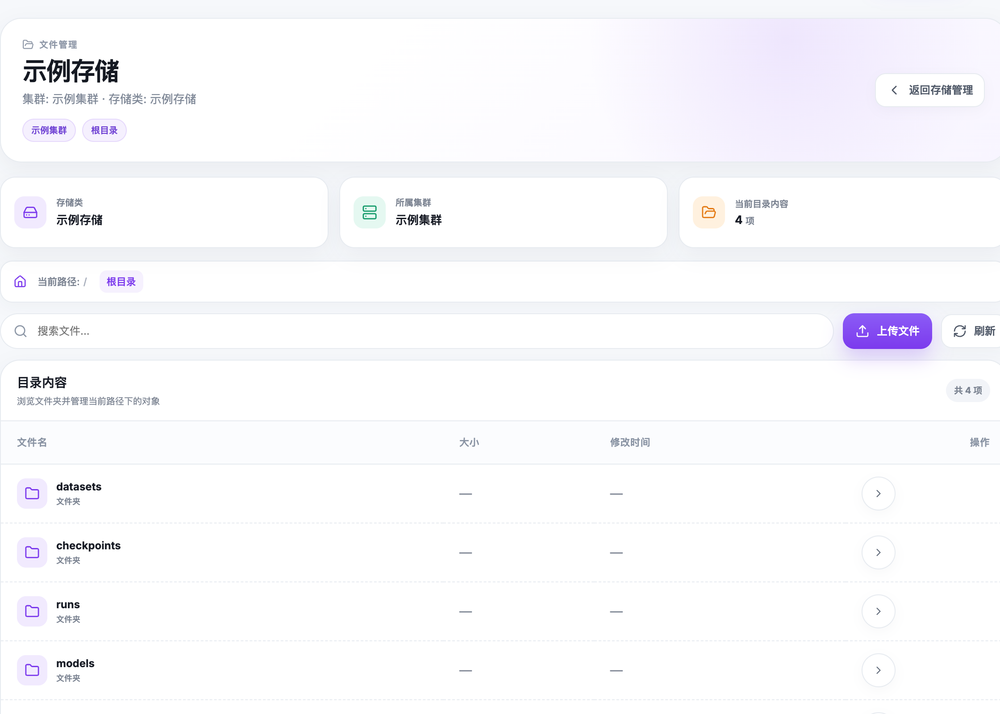

# Storage

## Storage Types

RLark supports two storage types for training jobs:

| Type | Use Case | Persistence |
|------|----------|-------------|
| Host Directory | Data already on the node, high I/O | Survives pod restarts |
| Object Storage (PVC) | Shared data, checkpoint persistence | Survives pod deletion |

## Host Directory

- Administrator must confirm the path exists on the target node with correct permissions
- Specify source path (node filesystem) and mount path (container filesystem)
- Data persists on the node after job deletion

## Object Storage

- Uses Kubernetes StorageClass and PVC
- PVC is auto-created with 10Gi request
- Select cluster first, then available StorageClasses appear in the dropdown
- Multiple workers can share the same PVC (be aware of RWO access mode limitations)

## Using Storage in a Training Job

When creating a job, in the Worker configuration step:
1. Select the storage type (hostPath or PVC)
2. Enter the source path (for hostPath) or select StorageClass (for PVC)
3. Enter the container mount path
4. Your training code reads/writes to the mount path

## Checking Read/Write

Verify the storage chain:
1. Source location is accessible
2. Container mount is correct
3. Application can read input data
4. Application can write output data
5. Output persists after job stops

## Cleanup

- Stopping a job: PVCs are preserved, hostPath data is preserved
- Deleting a job: PVCs are cleaned up, hostPath data is NOT cleaned up

## API Equivalent

Use StorageClass, provider, and object-file endpoints described in the [Storage API](../storage-api.md).