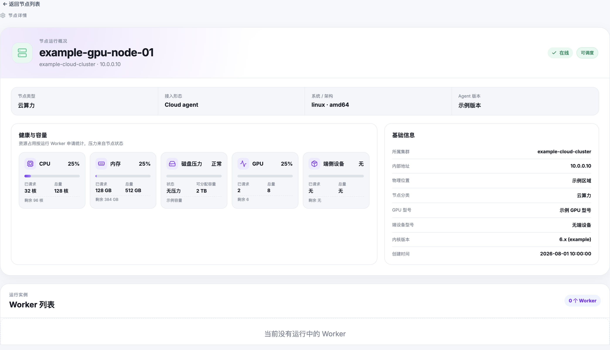

# 节点与资源管理

## 管理节点调度

管理员可通过切换节点的调度状态来控制节点是否接受新工作负载。

### 停止调度（Cordon）

- PATCH Node 资源：设置 `spec.unschedulable: true`
- 节点上已有的运行中 Worker 不受影响
- 新任务不会被调度到此节点
- 在维护、升级或节点异常时使用

### 恢复调度（Uncordon）

- PATCH Node 资源：设置 `spec.unschedulable: false`
- 节点恢复接受新工作负载
- 恢复调度前请确认节点健康

## 节点标签

- 管理员可为节点添加自定义标签以进行分类管理
- 用户在任务配置中通过 nodeSelector 使用标签
- 常用标签：`rlark.io/node-category`（cloud/edge/robot）、GPU 型号、位置

| 标签 | 可选值 | 说明 |
|------|--------|------|
| `rlark.io/node-category` | `cloud`, `edge`, `robot`, `other` | 节点类型 |
| `rlark.io/gpu-model` | `A100`, `V100`, `T4` 等 | GPU 型号（云端节点） |
| `rlark.io/device-model` | `franka`, `ur5`, `realsense` 等 | 具身设备型号 |
| `rlark.io/city` | 任意 | 物理位置（注解） |

## 查看节点资源

打开管理后台 → 节点，查看和管理节点：



节点详情包括：
- 调度状态（可调度 / 已停止调度）
- 节点类型、接入形态、操作系统、架构
- Agent 版本
- 资源使用情况：CPU、内存、GPU
- 节点上运行中的关联任务

## 通过 UI 操作

管理后台 → 节点 → 选择节点 → 切换调度状态或编辑标签。

## 通过 API 操作

```bash
# 停止调度
kubectl patch node <name> --type merge -p '{"spec":{"unschedulable":true}}'

# 恢复调度
kubectl patch node <name> --type merge -p '{"spec":{"unschedulable":false}}'

# 按类别列出节点
kubectl get nodes -l rlark.io/node-category=cloud
```