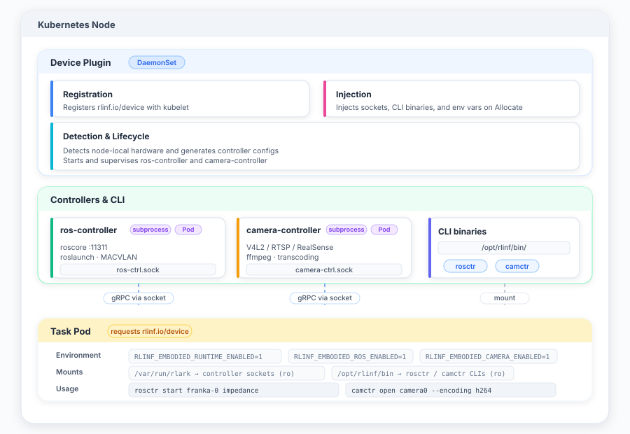

# 新设备适配

## 概述

RLark 的具身运行时（`apps/embodied-runtime`）使机器人和摄像头能够作为可调度设备资源参与训练任务。运行时由 Kubernetes 设备插件、基于 gRPC 的设备控制器和多语言 SDK 组成。

## 架构



深入了解 Embodied Runtime 内部细节请参见 [Embodied Runtime](embodied-runtime-reference.md)。

## 设备资源概念

RLark 区分两个概念：

| 概念 | 示例 | 说明 |
|------|------|------|
| 设备资源名称 | `rlinf.io/device-franka` | 在创建任务时用于调度，标识设备类型 |
| 设备 ID | `franka-robot-1` | 物理设备标识，在 Worker 内部通过 `rosctr list` 获取 |

创建训练任务时，用户指定设备资源名称和数量。调度器将 Worker 分配到具有所请求设备类型的节点上。实际设备 ID 在 Worker 内部通过 `rosctr list` 或 `camctr list` 发现。

## 添加新设备

### 第一步：定义设备资源

在设备插件配置中注册设备：

```yaml
# 示例：Franka 机器人设备
resources:
  - name: rlinf.io/device-franka
    count: 2  # 此节点上的设备数量
```

### 第二步：实现设备控制器

创建实现设备控制器接口的 gRPC 服务（`proto/embodied-runtime/`）：

```go
// 机器人控制器
service RobotController {
  rpc ListRobots(ListRobotsRequest) returns (ListRobotsResponse);
  rpc GetRobotStatus(GetRobotStatusRequest) returns (RobotStatus);
  rpc ExecuteAction(ExecuteActionRequest) returns (ExecuteActionResponse);
}

// 摄像头控制器
service CameraController {
  rpc ListCameras(ListCamerasRequest) returns (ListCamerasResponse);
  rpc GetCameraInfo(GetCameraInfoRequest) returns (CameraInfo);
  rpc CaptureFrame(CaptureFrameRequest) returns (CaptureFrameResponse);
}
```

### 第三步：部署控制器

在目标节点的 RLark Agent 旁边部署设备控制器：

```yaml
apiVersion: apps/v1
kind: DaemonSet
metadata:
  name: embodied-runtime-controller
spec:
  selector:
    matchLabels:
      app: embodied-runtime
  template:
    spec:
      containers:
      - name: controller
        image: rlark-embodied-runtime:latest
        volumeMounts:
        - name: device-socket
          mountPath: /var/run/rlark
      volumes:
      - name: device-socket
        hostPath:
          path: /var/run/rlark
```

### 第四步：测试发现

部署后验证设备可被发现：

```bash
# 在 Worker 容器内
rosctr list
# 预期输出：
# franka-robot-1  (rlinf.io/device-franka)  [READY]

camctr list
# 预期输出：
# video0  (rlinf.io/device-realsense)  [ACTIVE]
```

### 第五步：在任务中验证

创建请求新设备资源的测试 Job，验证 Worker 可以访问该设备。

## 真实设备安全要求

使用物理机器人时，以下安全措施是强制性的：

| 措施 | 说明 |
|------|------|
| 设备独占 | 真机任务必须独占安排，避免与其他任务共享 |
| Arming | 任务启动前需完成安全审批和设备 armed 状态确认 |
| 动作限制 | 设置关节位置、速度、力矩等安全边界 |
| 硬件急停 | 确认急停按钮可用且响应路径通畅 |
| 心跳超时 | 配置心跳超时，断连后自动进入安全状态 |
| 审计日志 | 记录操作日志用于事后审计 |

!!! warning "请勿直接操作真实机器人"
    在设备独占、人工确认、动作边界、急停、断连安全状态和恢复授权全部完成前，不要下发真机动作指令。

## 提交前检查清单

- [ ] 设备独占已确认
- [ ] 安全审批已通过
- [ ] 动作边界已配置
- [ ] 急停功能正常
- [ ] 心跳超时已配置
- [ ] 审计日志已启用

## CLI 工具

### rosctr

机器人控制器 CLI 工具：

```bash
rosctr list          # 列出可用机器人
rosctr status <id>   # 检查机器人状态
rosctr arm <id>      # 启用机器人
rosctr disarm <id>   # 停用机器人
```

### camctr

摄像头控制器 CLI 工具：

```bash
camctr list          # 列出可用摄像头
camctr info <id>     # 获取摄像头信息
camctr capture <id>  # 捕获一帧
```

## SDK 参考

### Python SDK

```python
from embodied_runtime import RobotClient, CameraClient

# 连接机器人
robot = RobotClient("franka-robot-1")
status = robot.get_status()
robot.execute_action({"type": "move_joint", "target": [0.1, 0.2, 0.3]})

# 连接摄像头
camera = CameraClient("video0")
info = camera.get_info()
frame = camera.capture()
```

完整 API 文档参见 `sdks/embodied-runtime-python/`。

### Go SDK

```go
import "github.com/rlinf/rlark/sdks/embodied-runtime-go"

client := embodiedruntime.NewRobotClient("franka-robot-1")
status, err := client.GetStatus(ctx)
```

完整 API 文档参见 `sdks/embodied-runtime-go/`。

## 节点类别

节点使用 `rlark.io/node-category` 标签标识其类型：

| 类别 | 说明 |
|------|------|
| `cloud` | 云端 GPU 计算节点 |
| `edge` | 带有具身设备的边缘计算节点 |
| `robot` | 与机械臂绑定的 NUC、工控机或移动机器人的车载计算机 |

!!! note "节点类别筛选"
    在控制台中使用节点类别标签筛选节点，并在 Job 的 nodeSelector 中针对特定硬件类型。

## 参考材料

| 资源 | 路径 |
|------|------|
| Embodied Runtime 参考 | [Embodied Runtime](embodied-runtime-reference.md) |
| Embodied Runtime CLI | `apps/embodied-runtime/docs/cli.md` |
| 部署示例 | `apps/embodied-runtime/docs/examples.zh-CN.md` |
| gRPC API | `proto/embodied-runtime/` |
| Python SDK | `sdks/embodied-runtime-python/` |
| Go SDK | `sdks/embodied-runtime-go/` |