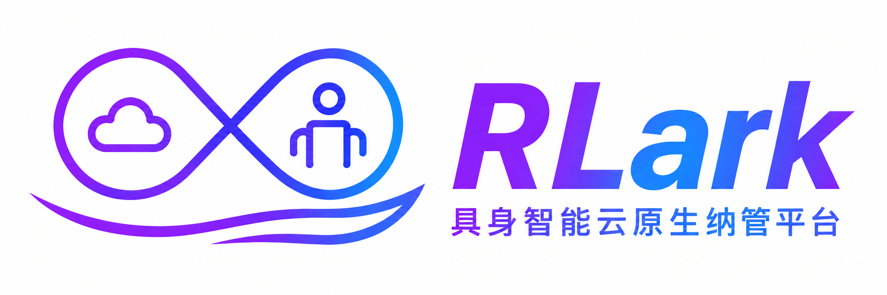

---
hide:
  - navigation
  - toc
---

<div align="center">
  
</div>

<div align="center" markdown>
  
  
  
</div>

<h1 align="center">
  <sub>RLark 具身智能云原生纳管平台</sub>
</h1>

以 Kubernetes 原生方式管理跨集群具身智能工作负载，从云端 GPU 训练到端侧设备部署。通过统一的任务调度、跨集群 Pod 网络互通和多运行时支持，实现 GPU 集群、机械臂、传感器等异构设备间的无缝协同。

## 最新动态

- [2026/08] RLark 现已开源。

## 核心能力

- **具身智能工作负载编排**：从云端 GPU 训练（RL/LLM）到端侧部署，统一的声明式 Job/Workflow/Task 抽象覆盖全链路
- **多运行时数据面**：原生支持 Kubernetes 运行时，Docker 和 Raw 运行时处于实验性阶段
- **跨集群资源抽象**：通过 Domain 和 Node CRD 统一管理多地 GPU 集群和端侧设备，控制面运行在 kcp 之上
- **声明式训练任务**：多层抽象，支持 DAG 编排的训练流水线，声明式定义 Ray 集群
- **跨集群 Pod 网络**：基于 TUN 设备 + gVisor 协议栈 + SSH 隧道的虚拟网络，Pod 跨集群通信无需 NAT 穿透
- **证书体系**：X.509 + SSH 双层证书，支持 Agent 接入、Domain 隔离、用户 SSH 登录鉴权
- **可观测性**：Prometheus 指标暴露、Pod 日志实时查询、Web 管理界面

## 架构概览


## 快速开始

```bash
# 1. 编译
git clone https://github.com/RLinf/RLark
cd RLark && make build

# 2. 启动控制面（Docker Compose）
docker compose -f apps/rlark/docs/examples/docker-compose.yml up -d

# 3. 启动数据面（kind 集群）
kind create cluster --name rlark-data

# 4. 一键部署所有组件
bash apps/rlark/docs/examples/quickstart.sh
```

详见 [快速开始指南](quickstart.md)。

## 使用 Web 控制台

```bash
cd apps/rlark-ui && npm install && npm run dev
```

浏览器访问 `http://localhost:5173`。详见 [Web 控制台](ui-behavior.md)。

## 技术栈

- **语言**：Go (控制面/Agent) + TypeScript (前端)
- **编排**：Kubernetes (kcp + kind)
- **网络**：TUN 设备 + gVisor netstack + SSH 隧道
- **证书**：X.509 mTLS + SSH 证书
- **数据库**：PostgreSQL (Bun ORM)
- **监控**：Prometheus
- **前端**：React + Vite + TypeScript