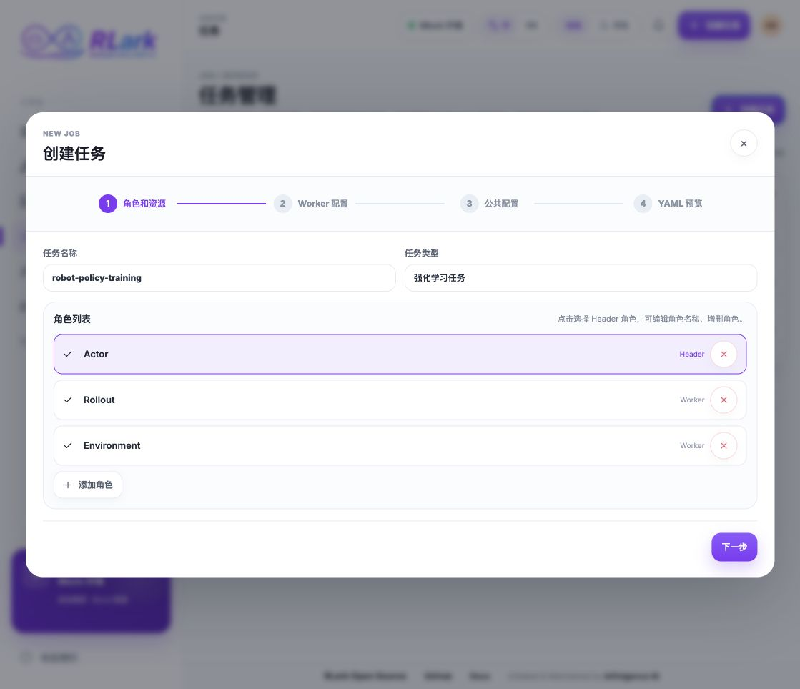

# 快速开始

本文档指导你完成 RLark 的最小完整闭环：部署控制面、以管理员身份生成数据面安装命令、在 Kubernetes 集群安装 Agent、验证资源上线，并创建第一个任务。

!!! note "标准接入流程与本地一键脚本"
    生产或共享环境应通过管理平台生成每个数据面集群专属的安装命令。本文的一键脚本仅用于本地体验，它自动执行了创建注册信息、签发 Agent 凭据和安装数据面的等价步骤。

## 环境要求

| 工具 | 版本 | 说明 |
|------|------|------|
| Docker | >= 24.0 | 运行 kcp、kind 集群和 Registry |
| kind | >= 0.20 | 运行本地 k8s 数据面集群 |
| kubectl | >= 1.28 | 与集群交互 |
| jq | >= 1.6 | 解析 JSON 响应 |

## 1. 部署控制面

```bash
# 使用 Docker Hub 镜像（推荐）
bash apps/rlark/docs/examples/quickstart.sh

# 或本地构建镜像
USE_LOCAL_REGISTRY=true bash apps/rlark/docs/examples/quickstart.sh
```

脚本会自动完成以下步骤，每步有日志输出：

| 步骤 | 说明 |
|------|------|
| 0 | 检查前置依赖（docker, kind, kubectl, jq, python3） |
| 1 | 创建运行时目录 `~/.rlark/certs` |
| 2 | 启动 kcp 和 PostgreSQL（Docker Compose） |
| 3 | 配置 kubeconfig 并安装 CRD 到 kcp |
| 4 | 创建 kind 集群 `rlark-data` |
| 5 | 将 kcp 和 PostgreSQL 接入 kind Docker 网络 |
| 6 | 准备镜像（Docker Hub 或本地构建） |
| 7 | 创建 ConfigMap（kubeconfig + DB 配置） |
| 8 | 部署控制面组件（Server、Controller-Manager、Gateway） |
| 9 | 生成 Agent 证书 |
| 10 | 部署 Agent（含 RBAC） |
| 11 | 验证部署状态 |

部署完成后，脚本输出 4 个 Running Pod 和注册的 Node。

## 2. 登录管理平台

本地调试时，启动 Web UI：

```bash
cd apps/rlark-ui
npm install
VITE_DATA_MODE=backend npm run dev
```

浏览器访问 `http://localhost:5173/admin`。管理平台账号固定为 `admin`，密码使用 `quickstart.sh` 完成摘要中 `Web UI credentials` 下的随机密码。生产环境使用 `rlarkadm` 安装摘要提供的密码，不存在通用默认密码。

业务平台账号固定为 `user`，密码来自同一安装摘要。若终端输出已经关闭，可以从本地 kcp Secret 重新读取：

```bash
# 管理员密码
kubectl --kubeconfig /tmp/rlark/admin.kubeconfig --context root \
  get secret rlark-ui-auth -n default \
  -o jsonpath='{.data.admin-password}' | base64 --decode; echo

# 平台用户密码
kubectl --kubeconfig /tmp/rlark/admin.kubeconfig --context root \
  get secret rlark-ui-auth -n default \
  -o jsonpath='{.data.user-password}' | base64 --decode; echo
```

| 服务 | 本地访问地址 | 用途 |
|---|---|---|
| 管理平台 | `http://localhost:5173/admin` | 集群纳管、节点、证书与系统配置 |
| 业务平台 | `http://localhost:5173` | 任务、Worker、工作流、存储和 SSH Key |
| Gateway API | `http://localhost:8080` | 自动化与系统集成 |

若部署在远程主机，请将 `localhost` 替换为控制面可访问域名，并由反向代理统一配置 HTTPS 与鉴权。

## 3. 纳管 Kubernetes 集群

**通过 UI：** 管理平台 → 集群管理 → 添加集群 → 生成安装命令。在目标 Kubernetes 集群执行该命令，然后返回管理平台等待 Agent 上线。


**通过 API / CLI：** 为集群签发 Agent 证书，将响应中的证书内容填入数据面配置，再执行安装：

```bash
export RLARK_GATEWAY="http://localhost:8080"
export CLUSTER_ID="agent-my-cluster-1"

curl --fail-with-body -X POST "$RLARK_GATEWAY/api/v1/certificates/agent" \
  -H "Content-Type: application/json" \
  -d "{\"cluster_id\":\"$CLUSTER_ID\"}" \
  -o agent-cert.json

cp apps/rlark/docs/examples/deploy-data-plane.yaml my-data-plane.yaml
# 将 agent-cert.json 中的 ca_cert、agent_cert、agent_key
# 填入 my-data-plane.yaml 对应的 cert 字段，然后安装：
rlarkadm install -f my-data-plane.yaml
```

`agent-cert.json` 包含私钥，必须按敏感凭据保护，安装完成后安全删除，不要提交到 Git 或粘贴到 Issue。

本地一键脚本已经自动创建 `rlark-data` kind 集群、签发 Agent 证书并完成 Agent 与 RBAC 部署，可直接进入下一步。

## 4. 验证集群和节点

**通过 UI：** 管理平台 → 集群与节点。确认：

- 集群状态在线，Agent 心跳正常；
- 至少一个可用 Worker 节点已经同步；
- 节点可调度，且资源分类、GPU 或具身设备信息符合实际情况。

控制面节点和其他非 Worker 节点不应计入业务平台可用容量。


**通过 API：** 查询已经注册的集群和 Agent 上报的节点：

```bash
export RLARK_GATEWAY="http://localhost:8080"

curl --fail-with-body "$RLARK_GATEWAY/api/v1/clusters" | jq
curl --fail-with-body \
  "$RLARK_GATEWAY/api/v1/rlinf.io/v1alpha1/nodes" \
  | jq '.items[] | {
      name: .metadata.name,
      cluster: .metadata.labels["rlark.io/cluster-id"],
      phase: .status.phase,
      unschedulable: .spec.unschedulable
    }'
```

## 5. 创建第一个任务

### 通过 UI

1. 打开业务平台：`http://localhost:5173/`。
2. 在登录页输入账号 `user`，密码使用安装摘要中的 `user` 随机密码，然后点击**登录**。
3. 在左侧导航点击**任务**，进入 `http://localhost:5173/jobs`。
4. 点击页面右上角的**创建任务**。
5. 在“角色和资源”中填写任务名称和任务类型，保留或调整 Actor、Rollout、Environment 角色。
6. 点击**下一步**，为每个 Worker 配置镜像、启动命令、副本数、CPU、内存以及所需 GPU 或具身设备。
7. 完成公共配置并检查 YAML 预览，点击**提交**。
8. 返回任务列表，等待状态变为**运行中**；点击任务名称进入详情，确认 Worker 已创建，再查看日志或打开终端。



_界面示意使用 Mock 数据，仅展示创建入口和表单结构；实际提交应使用 `VITE_DATA_MODE=backend`。_

### 通过 API

创建一个最小 Job，并轮询状态：

```bash
export RLARK_GATEWAY="http://localhost:8080"

curl --fail-with-body -X POST \
  "$RLARK_GATEWAY/api/v1/rlinf.io/v1alpha1/jobs" \
  -H "Content-Type: application/json" \
  -d '{
    "apiVersion": "rlinf.io/v1alpha1",
    "kind": "Job",
    "metadata": { "name": "hello-rlark" },
    "spec": {
      "tasks": [{
        "name": "actor",
        "head": true,
        "role": "Actor",
        "agentType": "Kubernetes",
        "kubernetes": {
          "workload": {
            "kind": "Deployment",
            "replicas": 1,
            "template": {
              "spec": {
                "containers": [{
                  "name": "actor",
                  "image": "busybox:latest",
                  "command": ["sh", "-c", "echo hello from RLark; sleep 3600"]
                }]
              }
            }
          }
        }
      }]
    }
  }'

curl --fail-with-body \
  "$RLARK_GATEWAY/api/v1/rlinf.io/v1alpha1/jobs/hello-rlark" \
  | jq '.status'
```

更完整的多角色任务、Workflow 和日志接口参见 [API 示例](api/examples.md)。

## 6. 清理体验环境

```bash
# 停止 kcp 和 PostgreSQL
docker compose -f apps/rlark/docs/examples/docker-compose.yml down

# 删除 kind 集群
kind delete cluster --name rlark-data

# 清理运行时文件
rm -rf ~/.rlark
```

## 下一步

- 阅读 [平台使用指南](user-guide/index.md) 通过图形界面管理资源和任务
- 阅读 [管理员指南](admin-guide/index.md) 了解生产部署、集群接入与运维
- 阅读 [核心概念](concepts.md) 了解资源模型和命名约定
- 阅读 [部署指南](deployment.md) 了解生产环境部署和真机设备纳管
- 阅读 [API 示例](api/examples.md) 了解完整 API 用法
