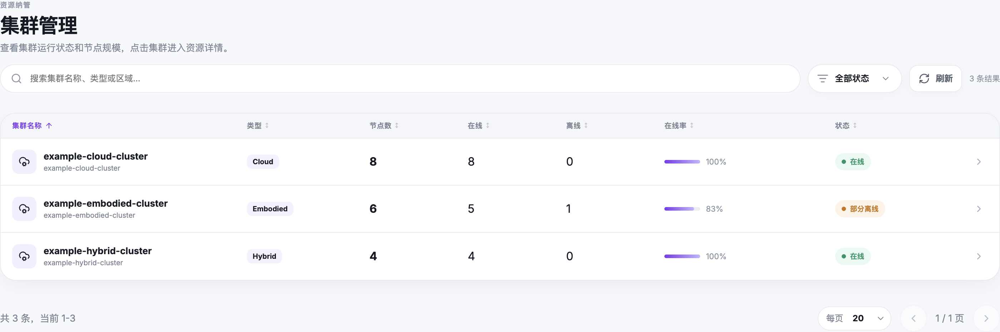
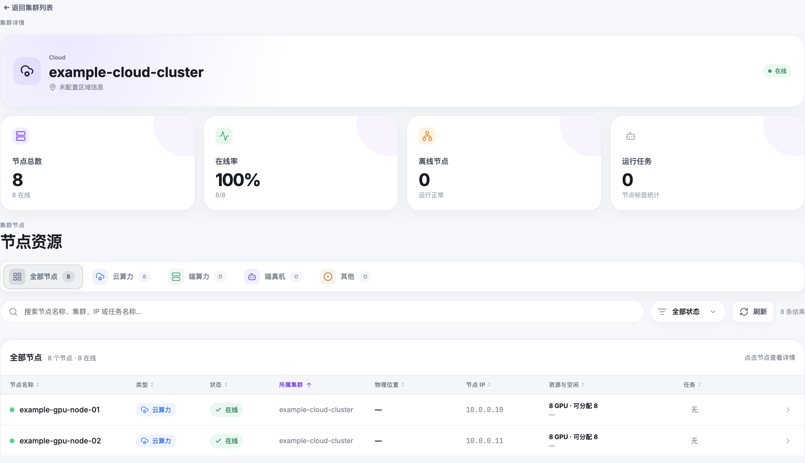

# 最佳实践

本指南将带你完成在 RLark 上提交强化学习训练任务的完整端到端流程，涵盖集群选择、SSH 密钥配置、网络域创建和任务提交。

## 概述

在 RLark 上完成一次 RL 训练任务，通常包含以下步骤：

1. **浏览可用集群和节点**，了解计算环境
2. **配置 SSH 密钥**，以便远程访问 Worker
3. **创建网络域**（如需跨集群通信）
4. **创建并提交训练任务**，配置正确的资源
5. **监控和验证**任务运行状态

---

## 第一步：浏览集群和节点

创建任务前，先确认目标集群和节点。

### 查看可用集群

进入管理后台或集群页面查看可用集群：



记录集群名称和节点标签。这些信息将在配置任务节点选择器时使用。

### 查看节点资源

点击集群查看其节点：



对每个节点，确认：

- **在线状态**：节点是否就绪
- **调度状态**：节点是否可调度（非 Cordon）
- **GPU 数量和型号**：节点是否满足任务 GPU 需求
- **标签**：应用了哪些标签（如 `rlark.io/node-category`、`rlark.io/gpu-model`）

点击节点查看详细资源使用：


!!! tip "记录节点选择条件"
    记下你要使用的精确标签键值对。例如：`rlark.io/node-category=cloud`、`rlark.io/gpu-model=A100`。

---

## 第二步：配置 SSH 密钥

SSH 密钥让你可以连接到 Worker 进行调试和检查。

### 添加 SSH 公钥

1. 进入用户菜单中的 **SSH 公钥**
2. 点击 **添加 SSH 公钥**
3. 输入便于识别的名称（如 `my-workstation`）
4. 粘贴公钥内容（如 `~/.ssh/id_ed25519.pub`）

```bash
# 如果没有密钥，先生成一个
ssh-keygen -t ed25519 -C "rlark-training"
```

公钥添加后即可在任务中使用。选择后，公钥会注入到每个 Worker 容器的 `~/.ssh/authorized_keys` 中。

### 轮换密钥

定期轮换 SSH 密钥以保障安全：

1. 在 SSH 公钥页面添加新密钥
2. 更新任务使用新密钥
3. 不再需要旧密钥后将其删除

---

## 第三步：创建网络域（可选）

网络域为跨集群 Worker 通信提供虚拟网络。如果所有 Worker 都在同一集群内运行，可跳过此步骤。

### 何时需要创建网络域

- Worker 分布在多个集群
- Worker 需要通过虚拟网络互相通信
- Ray 需要跨集群节点发现

### 创建网络域

1. 进入 **管理后台** → **网络域**
2. 点击 **创建网络域**
3. 配置：
   - **CIDR**：选择一个未被任何集群使用的私有 IP 段（如 `10.100.0.0/16`）
   - **名称**：输入便于识别的名称
4. 点击 **创建**

网络域会为加入的 Worker 分配虚拟 IP，并通过 SSH 隧道建立跨集群流量转发。

!!! warning "CIDR 不能重叠"
    网络域的 CIDR 不能与任何集群的 Pod CIDR 或 Service CIDR 重叠，也不能与其他网络域重叠。

---

## 第四步：创建并提交训练任务

### 准备 RLinf 运行信息

创建任务前，从现有 RLinf 配置中确认以下信息：

| 项目 | 示例 |
|------|------|
| 容器镜像 | `registry.example.com/rlinf:v0.3.0-cuda12.4` |
| 每个 Worker 的 GPU 数量 | `8` |
| RLinf 配置 | `cluster.num_nodes: 1` |
| 启动命令 | `python -m rlinf.run config.yaml` |
| 数据路径 | `/data/inputs`、`/data/outputs` |

### 创建任务

1. 进入 **任务** → **创建任务**

2. **填写基本信息**：
   - 任务名称：小写字母、数字、连字符（如 `my-training-run-001`）
   - 任务类型：单节点选 **自定义任务**，多角色可选用模板

3. **配置 Worker 角色**：

   单节点任务：
   - 添加一个名为 `worker` 的角色
   - 设为 **Header**（此 Worker 会启动 Ray Head）
   - **已选节点数** 设为 `1`

   

4. **配置每个 Worker**：

   | 字段 | 说明 |
   |------|------|
   | **集群** | 选择该角色使用的集群 |
   | **节点选择** | 添加标签限定目标节点（如 `rlark.io/gpu-model=A100`） |
   | **已选节点数** | 必须等于该角色预期的 Worker 数量 |
   | **GPU** | 每个 Worker 的 GPU 数量 |
   | **镜像** | 完整镜像地址，带版本 tag 或 digest |
   | **准备脚本** | Ray 启动前执行的命令（环境激活、目录准备等） |
   | **存储挂载** | 主机目录或对象存储挂载 |

5. **配置公共设置**：

   | 设置 | 说明 |
   |------|------|
   | **Header 角色** | 必须是恰好有 1 个 Worker 的角色 |
   | **网络域** | 如需跨集群通信则选择 |
   | **SSH 公钥** | 选择注入 Worker 的公钥 |
   | **运行脚本** | Ray 就绪后执行的主命令 |
   | **TensorBoard 目录** | 容器内 TensorBoard 日志路径 |

6. **预览并提交**：

   仔细检查 YAML 预览：

   - 确认 `spec.tasks[]` 数量与角色数量一致
   - 确认 `nodeSelector` 只匹配目标集群
   - 确认 Header 角色恰好有 1 个副本
   - 确认镜像使用明确版本 tag，而非 `latest`
   - 确认环境变量和脚本中无敏感信息

   确认无误后点击 **提交**。

!!! danger "保护敏感信息"
    禁止在环境变量、准备脚本、运行脚本或 YAML 中包含密码、私钥、访问令牌或对象存储密钥。

---

## 第五步：监控和验证

提交后，验证任务是否正常运行。

### 检查任务状态

1. 进入 **任务列表**，找到你的任务
2. 点击任务打开详情


### 验证 Worker Pod

- 确认预期数量的 Worker 正在运行
- 确认 Worker 调度到了预期节点
- 确认每个 Worker 的资源分配（GPU、设备）

### 查看日志

打开 Worker 日志确认：

- Ray Head 已成功启动
- 所有 Ray 节点已加入集群
- 运行脚本已开始执行
- 训练输出正常出现


### 验证持久化输出

确认 checkpoint 和训练结果已写入配置的存储路径。

### 常见问题

| 症状 | 排查方向 |
|------|---------|
| 任务卡在 Pending | 确认节点选择器匹配可用节点 |
| Worker 未创建 | 检查已选节点数是否与节点选择器匹配数一致 |
| 运行脚本失败 | 查看日志检查环境或依赖错误 |
| 跨集群网络失败 | 确认网络域已创建且 CIDR 不重叠 |

---

## 下一步

- [创建训练任务](jobs.md) — 详细字段参考
- [工作流](workflows.md) — 多角色和异构 Worker
- [在任务中使用存储](storage.md) — hostPath 和对象存储配置
- [通过 SSH 连接 Worker](ssh-keys.md) — SSH 到运行中的 Worker