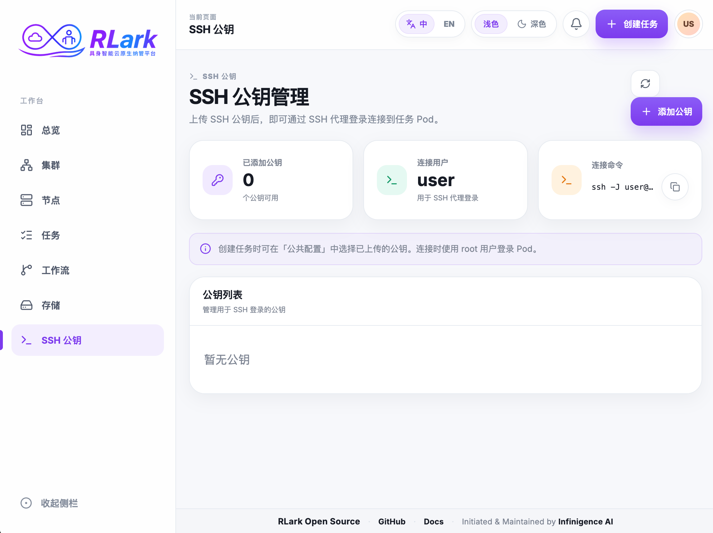

# SSH 密钥

使用本指南登记用于 RLark SSH 堡垒机认证的公钥，并可选择在创建 Job 时将其写入任务配置。



## 任务一：添加公钥

1. 为 RLark 生成专用密钥对，切勿上传私钥。
2. 在业务平台打开 **SSH 公钥**，选择**添加公钥**。
3. 输入 SSH 用户名。该名称必须与 SSH 命令使用的用户名一致。
4. 粘贴一条 OpenSSH 公钥，例如 `ssh-ed25519` 或 `ssh-rsa`。
5. 选择**确认添加**，并确认密钥出现在列表中。

RLark 会校验公钥格式并拒绝重复密钥。当 Server SSH 地址可用时，页面还会显示配置好的跳板连接命令。

## 任务二：为 Job 选择密钥

1. 打开**任务**并开始创建 Job。
2. 在**公共配置**的 **SSH 公钥注入**中选择已上传的密钥。
3. 检查 YAML 预览，确认 `spec.sshPublicKey` 包含所选公钥。
4. 提交 Job。

此操作会把一条公钥写入 Job 配置，供工作负载注入。只在 SSH 公钥页面登记密钥不会修改已有 Job 或 Pod。

## 任务三：通过堡垒机连接

管理员配置 Server SSH 入口后，使用控制台显示的命令，或从 Job/节点详情复制指定 Worker 的命令。典型命令如下：

```bash
ssh -J <ssh-user>@<bastion-host>:<port> root@<worker-name>
```

外层 SSH 用户名必须与公钥登记的用户名一致。目标容器必须提供 SSH 服务，并接受所选公钥。

!!! warning "没有 Pod 级授权"
    当前 SSH Server 会认证用户名和已登记公钥，但尚未实现把该用户限制到特定 Pod 的授权检查。应将堡垒机访问视为受信任用户访问，不要把密钥登记描述为仅授予所选 Pod 的访问权限。

## 任务四：删除或轮换密钥

1. 添加替换公钥，并在新建 Job 中使用它。
2. 使用替换后的私钥验证访问。
3. 从 **SSH 公钥**中删除旧密钥。
4. 重建或单独更新已经包含旧密钥的工作负载。

删除登记密钥会阻止该用户名/密钥组合后续通过堡垒机认证，但不会移除已经复制到运行中工作负载内的公钥。

## 安全注意事项

- 密钥记录按输入的 SSH 用户名存储，不按当前控制台会话隔离。
- 任何持有对应私钥的人都能以该 SSH 用户名认证。
- 切勿把私钥上传或写入 Job YAML、脚本及环境变量。
- 首次使用前核对堡垒机主机密钥指纹，并定期轮换密钥。

!!! warning "当前安全边界"
    RLark 当前未明确记录持久化 SSH 认证/连接审计日志的位置，请勿将平台作为 SSH 审计的唯一记录系统；应在堡垒机外部接入集中日志与留存机制。平台尚未内置 SSO/OIDC 集成，生产环境应通过外部支持 SSO/OIDC 的访问代理或堡垒机实施身份与访问策略。SSH 密钥记录和堡垒机授权不按租户或 Pod 隔离；互不信任的租户应使用独立部署或分别管控的堡垒机。

## API 等效操作

使用 `GET`、`POST /api/v1/ssh-user-keys` 和 `DELETE /api/v1/ssh-user-keys/{index}?user={user}`。详见 [API 参考](../api/reference.md)。
